2.2	基于无人机序列影像近实时半密集匹配技术

在SLAM影像实时定位技术的研究基础上，针对SLAM特征点难以满足现场快速初步还原的需求，开展了基于GPU加速的半密集匹配研究。

在现有的众多GPU框架中（CUDA、OpenCL、OpenAcc、OpenMP、C++\AMP……），出于对性能、易编程性和平台兼容性的综合考虑，选择C++\AMP作为加速框架，C++\AMP具有与CUDA相似的加速效果，显卡抽象结构更清晰，支持非NVIDIA的显卡。

对半密集匹配的5个主要步骤：1）几何约束2）极线搜索3）逆深度概率融合4）帧内平滑5）帧间平滑，已完成1-3的GPU加速编程，4-5的GPU加速将在未来的研究中实现。在实验中，采用室内拍摄的彩色影像，每帧影像大小降采样为500x500像素，通过实验所获取的GPU加速版本与CPU版本的算法对比如表2所示，室内外的半密集匹配结果如图 1及图 2所示（主要集中地形和室内目标特征区域）。
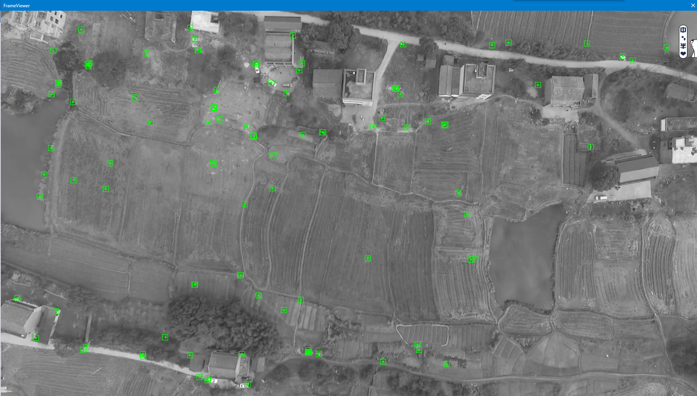
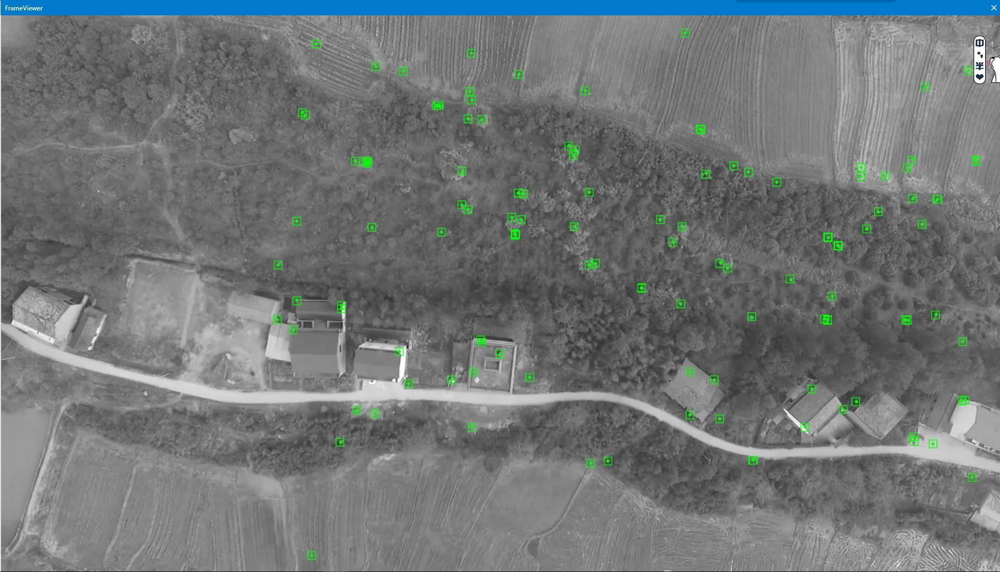

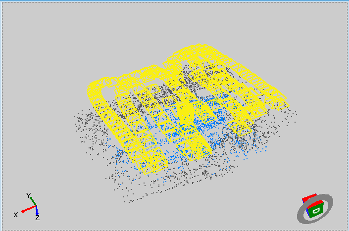

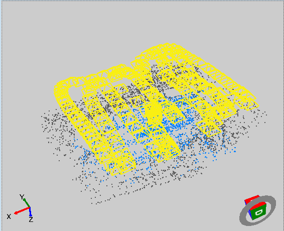
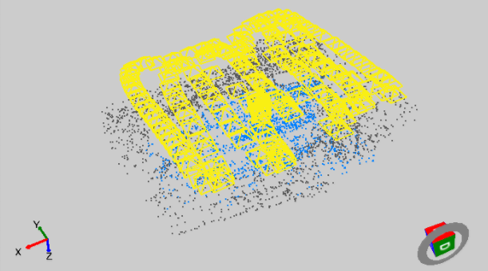

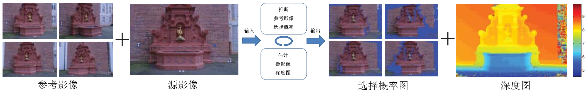

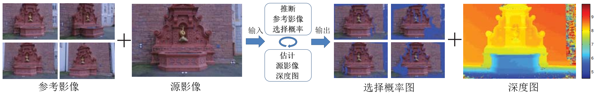

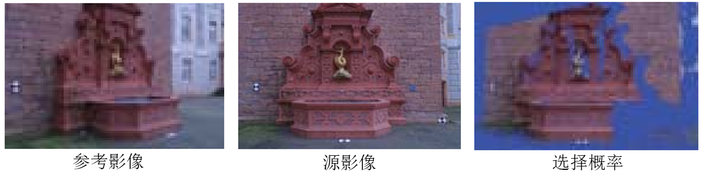
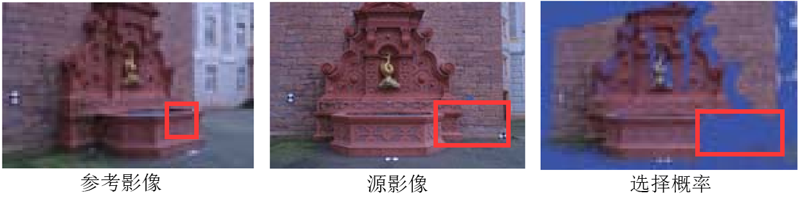

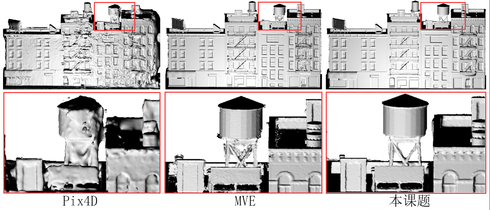

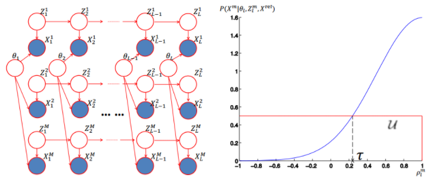

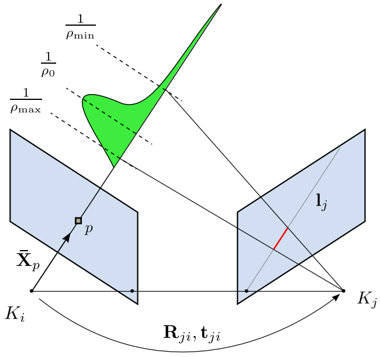
