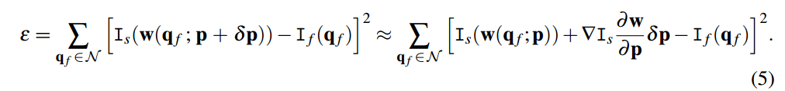
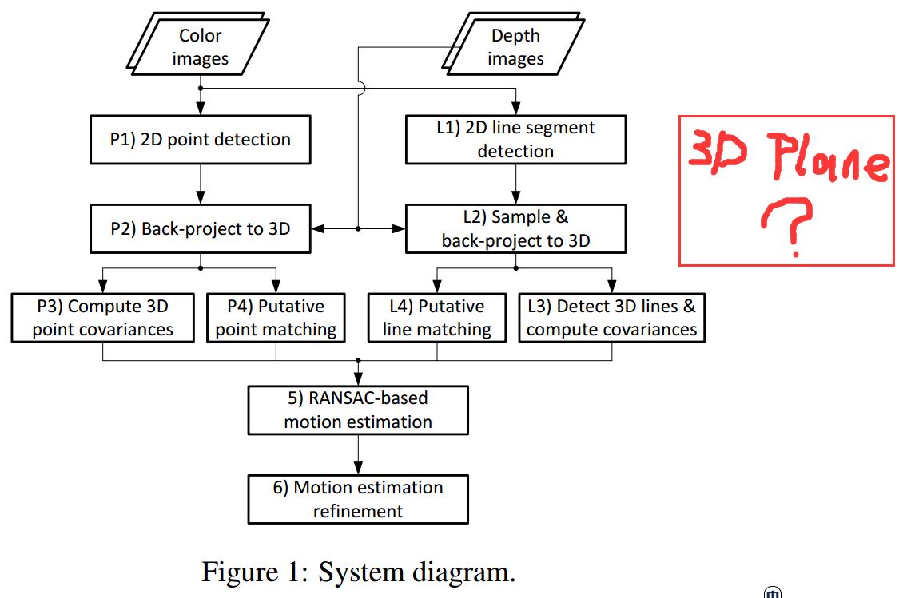

# 论文思路

## 在RGBD相机中 用没有尺度不变性的特征来代替SIFT

## 基于Patch的RGBD建模

## 基于点、线、面特征的RGBD视觉里程计
将面特征加入现有SLAM系统，

定义三者的表达方式

建立三者的联合误差函数

推导关于扰动的导数。

# 点线面特征的RGBD里程计

## 《Plane-based Odometry using an RGB-D Camera》（BMVC 2013）
首次考虑了面元作为观测条件
但是在代价函数中只考虑了光度误差

> 使用光度误差时，基于一种非常强的假设，它要求物体是朗伯的，且环境中光照分布均匀。

没有利用RGB-D相机提供的深度信息

## 《Robust RGB-D Odometry Using Point and Line Features》（ICCV 2015）
结合了点、线特征，给出了联合观测误差函数。

没有考虑面特征。

## 《SPLODE: Semi-Probabilistic Point and Line Odometry with Depth Estimation from RGB-D Camera Motion》（IROS 2017）

思路与流程与ICCV2015没有区别。

# 使用平面特征的优势

## 利用低纹理区域

基于特征点和特征线的方法，需要对其2D位置进行准确观测，依赖强烈的灰度变化；光流法克服了这一缺点，能在低梯度的表面上估计运动方向，但光流法鲁棒性极差，因为环境对光流的影像是剧烈的。

通过对面特征进行观测，可以有效利用室内场景中存在的大范围低纹理区域。

## 更精确、更鲁棒

平面特征相较于点、线特征，由于具有一整块区域，观测范围大，所以噪声更小、更稳定。
