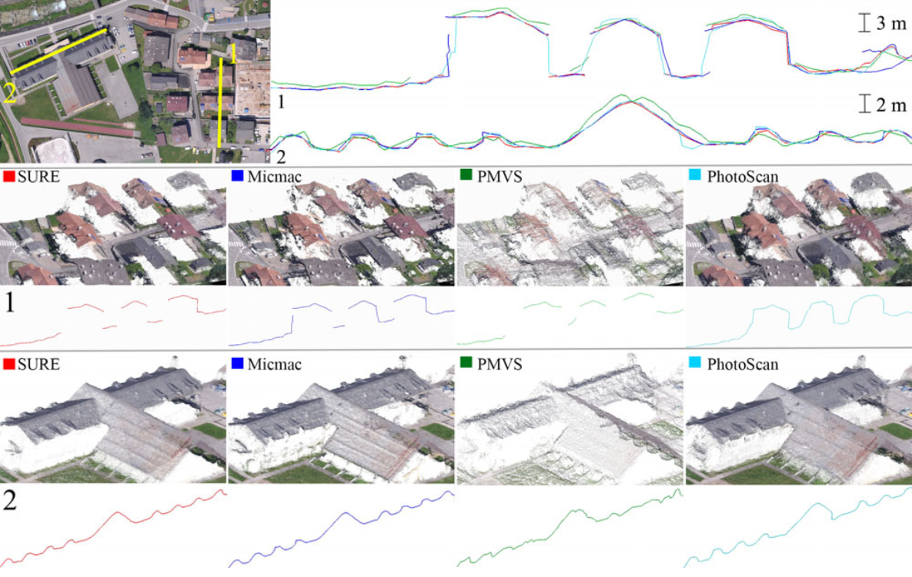
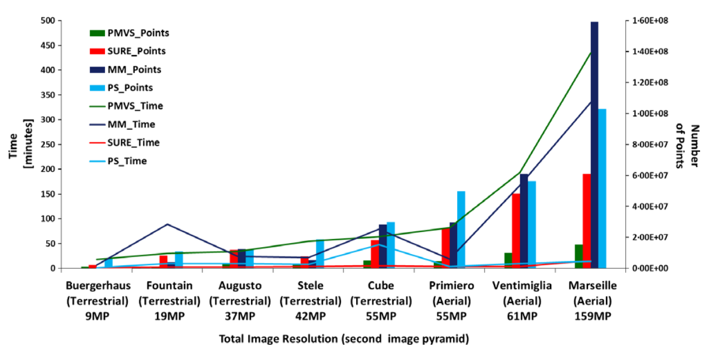
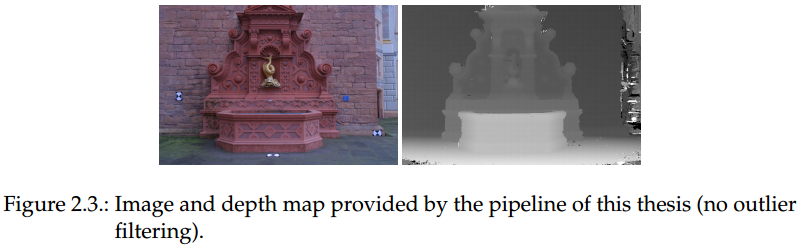
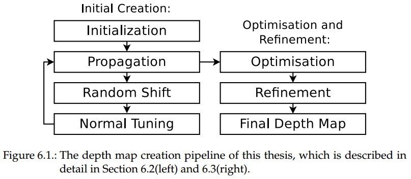
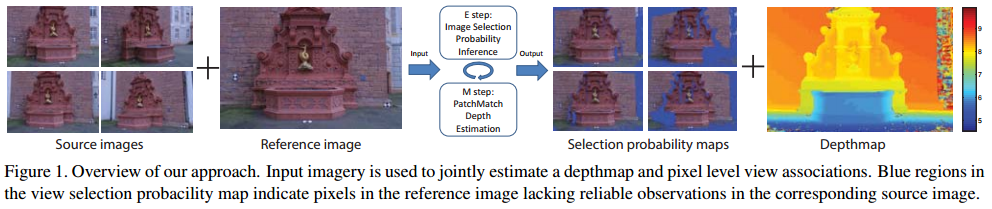
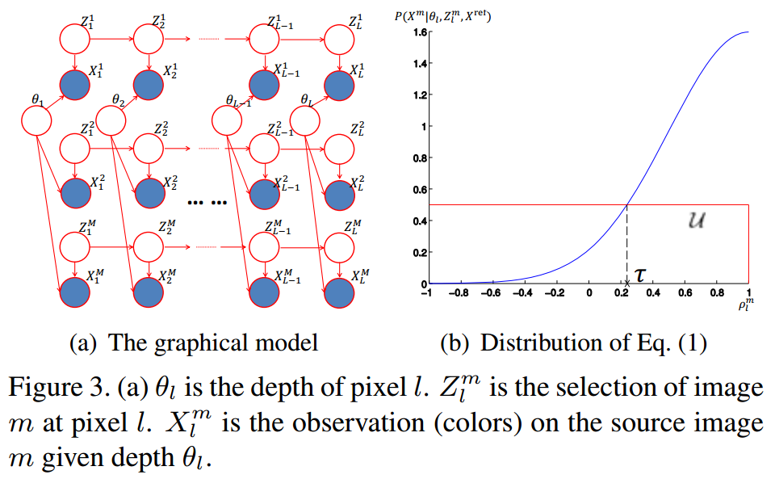

# 多视深度估计中的视点选择

**概念**

> **多视深度估计（MVDE）**
利用一族具有重叠度的影像来建立像素的深度信息。许多应用都需要高质量的深度图：**三维密集重建**、**分类与识别**、**基于影像的渲染**。本文介绍MVDE中在视点选择方面的进展。

> **MVS(Multi View Stereo)** 多视立体，主要指从影像恢复立体模型的方法，包括**影像选择**、**深度图重建**、**点云生成**和**格网生成**。

> **MVG(Multi View Geomery)** 多视几何学，主要论述多视影像、像素（二维）、体素（三维）间的**几何关系**。

> **SfM(Structure from Motion)** 从运动到结构，主要指从影像恢复**位姿**的方法。

> **参考影像(Reference Image)** 用来创建深度图的影像，它的视点就是深度图的视点。

> **源影像(Source Image)** 也称次级影像（Secondary Image），一张参考影像至少需要一张匹配的源影像来完成深度估计。

## 多视立体与多视几何

> 多视深度估计只是MVS系统中的一个中间步骤，这里先介绍行业知名的MVS系统。

> **参考文献**：
>  [1] 《State of the Art in High Density Image Matching》
>  [2] 《Multi View Geomery in Computer Vison》 **MVG推荐教程**
>  [3] 《Multi-View Stereo: A Tutorial》 **MVS推荐教程**

在MVS系统中，通常先估计所有视点的深度图，然后将深度图融合成点云，一些知名的开源MVS系统如下表：

| Project |  Language | License |
| ---  | --- | --- |
[GPUIma + fusibile](https://github.com/kysucix) | C++ CUDA | GNU General Public License - contamination|
[HPMVS](https://github.com/alexlocher/hpmvs) | C++ | GNU General Public License - contamination|
|[MICMAC](http://logiciels.ign.fr/?Micmac) | C++ | CeCILL-B |
[MVE](https://github.com/simonfuhrmann/mve) | C++ | BSD 3-Clause license + parts under the GPL 3 license|
[OpenMVS](https://github.com/cdcseacave/openMVS/) | C++  (CUDA optional) | AGPL3|
[PMVS](https://github.com/pmoulon/CMVS-PMVS) | C++ CUDA | GNU General Public License - contamination|
[SMVS Shading-aware Multi-view Stereo](https://github.com/flanggut/smvs) | C++ | BSD-3-Clause license |

一些代表性软件：

|项目|版权|点云密度|速度|
| --------- | -------- | ------------------------------ | ------------------------ |
| SURE      | 闭源免费 | &star;&star;                   | &star;&star;&star;&star; |
| MicMac    | 开源免费 | &star;&star;&star;&star;&star; | &star;&star;             |
| PMVS      | 开源免费 | &star;                         | &star;                   |
| PhotoScan | 商业收费 | &star;&star;&star;&star;       | &star;&star;&star;&star; |

应当特别说明的是：

* **MICMAC**是一套内容丰富的工具集，可操作性强，但建立较好的模型，需要较强的专业知识和一定的软件使用技巧。它的密集匹配过程利用了GPU进行加速，但实测时，加速效果不明显。
* **PhotoScan**作为商业软件，稳定性强，操作简单，产生的点云丰富，速度快。
* **PMVS**是极不成熟的开源库，性能优化较差，但从点云密度上讲，不能说PMVS效果差，更可能是参数设置问题。

上面的测试结果引用自文献[1]。在这些MVS系统中，都包括深度图重建这一过程，这是产生密集点云所必须的。在整个密集点云产生流程中，深度图重建算法在系统中的地位至关重，它最困难且最耗时。MVS系统需要为深度图重建提供一些必要的前处理流程，在进行深度重建以前，应有以下数据：

* 去畸变的影像
* 每张影像的姿态
* 相机的绝对位置或相对位置
* 焦距或内参数矩阵

这些数据均可由SfM过程产生，SfM所运用的MVG可参考文献[2]，这里总结了常用的SfM库，（较完整的MVS库也包含了SfM模块）：

| Project |  Language | License |
| ---  | --- | --- |
|[Bundler](https://github.com/snavely/bundler_sfm) | C++ | GNU General Public License - contamination|
|[Colmap](https://github.com/colmap/colmap) | C++ | GNU General Public License - contamination|
|[MAP-Tk](https://github.com/Kitware/maptk) | C++ | BSD 3-Clause license - Permissive |
|[MicMac](https://github.com/micmacIGN) | C++ | CeCILL-B |
|[MVE](https://github.com/simonfuhrmann/mve) | C++ | BSD 3-Clause license + parts under the GPL 3 license|
|[OpenMVG](https://github.com/openMVG/openMVG) | C++ |  MPL2 - Permissive|
|[OpenSfM](https://github.com/mapillary/OpenSfM/) |  Python | Simplified BSD license - Permissive|
|[TheiaSfM](https://github.com/sweeneychris/TheiaSfM) | C++ |   New BSD license - Permissive|

## 深度图重建

> **参考文献**：
>  [4] 《Scale Robust Multi View Stereo》

> [5] 《Using Multiple Hypotheses to Improve Depth-Maps for Multi-View Stereo》
>  [6] 《Real-time Plane-sweeping Stereo with Multiple Sweeping Directions》
>  [7] 《Multi-View Stereo: Redundancy Benefits for 3D Reconstruction》

> [8] 《Accurate, Dense, and Robust Multi-View Stereopsis》
>  [9] 《Progressive Prioritized Multi-view Stereo》
>  [10] 《Multi-View Stereo for Community Photo Collections》

> [11] 《Accurate and Efficient Stereo Processing by Semi-Global Matching and Mutual Information》
>  [12] 《Stereo Vision in Structured Environments by Consistent Semi-Global Matching》
>  [13] 《Stereo Processing by Semiglobal Matching and Mutual Information》

> [14] 《PatchMatch: A Randomized Correspondence Algorithm for Structural Image Editing》
>  [15] 《PatchMatch Stereo - Stereo Matching with Slanted Support Windows》

深度图是一种简单的表示3D曲面的方法，它的数据结构是2D影像而不是3D曲面。为了创建一张深度图，需要一张**参考影像**以及至少一张**源影像**，在他们之间形成配对，并通过三角测量来获得像素的深度。当前，有两大类深度图重建的方法：

* **逐像素** 为每一个像素都计算其深度值（文献[5-7][11-13]）。
* **区域生长** 从一些已知深度的特征点向其领域扩散（文献[4][8-10][15]）。

其中，文献[8]是PMVS的论文，文献[11-13]是SGM的论文。这里简单介绍文献[4]所用的深度图重建流程，包括下面几个步骤：

* **深度图初始化** 计算特征点的深度。
* **深度传播** 利用法向量信息，将特征点的深度扩散到它的领域。
* **随机浮动** 深度图随机改变一些值，如果测量误差值减小，新值会被保留。
* **法线计算** 利用深度图计算法线，法线能将影像块从**参考影像**变换到**源影像**，从而优化**深度传播**。
* **深度图优化** 利用梯度下降法，搜索每一像素的最优深度。
* **深度图精化** 利用双边滤波器对深度图进行平滑，设置每个深度值的最低支持数来剔除粗差。

文献[3]所使用的算法是基于块匹配的（块匹配算法参考文献[14]，快匹配的立体视觉算法参考文献[15]），并且适用于GPU。可以看到，**深度传播**与**法线计算**相互依赖，两者在迭代中趋于稳定，优化任一算法，都能改进最终的深度图精度。

要了解更多深度图重建的内容，可参考这篇笔记：

> [Scale Robust Multi View Setero](https://github.com/FishHe/MyNote/blob/master/ComputationalPhotography/MVS/Scale%20Robust%20Multi%20View%20Setero.md)

## 视点选择

> **参考文献**：
>  [16] 《PatchMatch Based Joint View Selection and Depthmap Estimation》
>  [17] 《Pixelwise View Selection for Unstructured Multi-View Stereo》
>  [18] 《Markov Random Field Modeling in Image Analysis》

文献[17]与文献[16]的主要深度重建流程基于文献[3]。文献[16]与文献[17]提出了基于MRF的像素级视点选择的方法。文章使用的图模型，可参考文献[18]。

### 图模型

在下面的论述中，用
$X^{ref}$
表示被估计深度的参考影像，用
$X^{1}$，$X^{2}$，...，$X^{M}$，表示已知位姿的源影像，这些影像的位姿可由前述的SfM系统给出。在参考影像
$X^{ref}$
上的每个像素
$l$
的深度用
$\theta_l$
表示。

由于遮挡、畸变误差、光照不均等因素，从多张源影像上估计的深度是不一致的。因此，对参考影像进行深度估计，必须确定一个鲁棒的源影像子集。用二进制变量
$Z^{m}_{l}\in\{0,1\},m=1,2,...M$
表示参考影像
$X^{ref}$
上每一个像素
$l$
是否将源影像
$X^{M}$
纳入用于深度估计的子集。

即是说，对于参考影像上的每个像素点，都保存了一个二进制序列，序列的第
$M$
个比特表示源影像
$X^{M}$
是否用于该点的深度估计。如某像素有的序列为
$\{1,1,0,1\}$
，表示源影像有4个参考影像，且该像素用第1、2、4张参考影像来进行深度估计。

首先定义似然函数。给定参考影像
$X^{ref}$
上的一个像素
$l$
，称它和它的领域为色块
$X^{ref}_{l}$
。
利用像素
$l$
处的正确深度
$\theta_l$
，可求得其在源影像上对应的色块（对应点及其领域）
$X^{m}_{l}$
。使用NCC(Normalized Cross Correlation，归一化互相关测度)来比较两个色块，并记其值为
$\rho^{m}_{l}$。

当
$Z^{m}_{l}=1$
，参考色块与源色块匹配的色彩连续性较高，观测的可能性更大；当
$Z^{m}_{l}=0$
，观测
$X^{m}_{l}$
的概率与
$X^{ref}_{l}$
无关，且应当是均匀分布。所以，似然函数如下：

$$P(X_{l}^{m}|Z_{l}^{m},\theta_{l},X^{ref}_{l})=
\begin{cases}
\frac{1}{NA}e^{-\frac{(1-\rho _{l}^{m})^2)}{2\sigma ^ 2}} & \text{ if } Z_{l}^{m}= 1\\
\frac{1}{N}\mathcal{U} & \text{ if } Z_{l}^{m}= 0
\end{cases}$$

其中，
$A=\int^{1}_{-1}exp\{-\frac{(1-\rho)^2}{2\sigma^2}\}d\rho$
，$N$为常数。为了简化形式，假设能够产生NCC值的色块
$X_{l}^{m}$
的个数均等于$N$。
由于所有色块
$X^{ref}_{l}$
都会被计算，下面的叙述中，用
$P(X_{l}^{m}|Z_{l}^{m},\theta_{l})$
表示
$P(X_{l}^{m}|Z_{l}^{m},\theta_{l},X^{ref}_{l})$。

沿着传播方向的平滑通过邻近像素的选择约束实现，相邻像素具有同时选择
$X^{m}$
作为可用源影像的倾向，当
$\gamma$
越接近1时，这种倾向越明显。因此，转移概率如下：

$$P(Z^{m}_{l}|Z^{m}_{l-1})=
\left(\begin{matrix}
\gamma & 1-\gamma \\
1-\gamma & \gamma \\
\end{matrix}\right)
$$

为了满足并行计算的条件，算法在平行传播过程中只执行同一行像素的成对约束。上图左，只展示了每一张源影像的一行选择变量。上图右表明，阈值
$\tau$
由
$\sigma$
决定，当
$\rho _{l}^{m}>\tau$
时，影像$m$被选择的可能性更大，反之亦然。

为每个像素寻找最优的视点集合并求其深度这一问题，等价于求取最大后延概率
$P(\boldsymbol{Z},\boldsymbol{\theta}|\boldsymbol{X})$。结合上图左，联合概率由下式给出：
$$
P(\boldsymbol{Z},\boldsymbol{\theta},\boldsymbol{X})=
\prod_{m=1}^{M}[P(Z_1^m)\prod_{l=2}^LP(Z_l^m|Z_{l-1}^m)\prod_{l=1}^LP(X_l^m|Z_l^m,\theta_l)]\prod_{l=1}^LP(\theta_l)
$$

其中
$L$是参考影像上演着传播方向的像素个数。公式推导时，要注意
$\boldsymbol{\theta}$
与
$\boldsymbol{Z}$
无关。

假设，
$P(Z^m_l)$
和
$P(\theta_l)$
都是均匀分布（因为在没有观测前，我们不能得到任何参考），但要计算最大后验概率，还需要
$P(\boldsymbol{X})$，这是难于计算的。

为了避免计算
$P(\boldsymbol{X})$
，文章使用变分推断（变分贝叶斯期望最大算法）来估计
$P(\boldsymbol{Z},\boldsymbol{\theta}|\boldsymbol{X})$
。

### 变分推断

> **参考文献**
>  [19]《A View of The EM Algorithm That Justifies Incremental, Sparse, and Other Variants》
>  [20]《A Tutorial on Variational Bayesian Inference》

文章[16]使用了类似[19]的算法，关于变分贝叶斯推断的详细资料，可参考文献[20]。

变分推断考虑一个受限的分布族
$q(\boldsymbol{Z},\boldsymbol{\theta})$
，从中寻找一个近似的后验分布
$P(\boldsymbol{Z},\boldsymbol{\theta}|\boldsymbol{X})$
，使得两分布间的KL散度有最小值。

真正的后验分布建立在隐变量
$\boldsymbol{Z}=\{\boldsymbol{Z}^m|m=1,...,M\}$
与
$\boldsymbol{\theta}$
上，
其中
$\boldsymbol{Z}^m=\{Z^m_1,Z^m_2,...,Z^m_L\}$
是图中沿着传播方向的一条链。

下面给
$q(\boldsymbol{Z},\boldsymbol{\theta})$
添加约束，使它能被参数化为一系列分布：
$$
q(\boldsymbol{Z},\boldsymbol{\theta})=\prod_{m=1}^{M}q_m(\boldsymbol{Z}^m)
\prod_{l=1}^Lq_l(\theta_l)
$$

为了便于处理，把定义
$q_l(\theta_l)$
为克罗内克函数：
$$
q_l(\theta_l)=
\delta(\theta_l=\theta_l^*)=
\begin{cases}
1 && \text{ if } \theta_l=\theta_l^* \\
0 && \text{ otherwise }  \\
\end{cases}
$$

其中
$\theta_l^*$
是要被估计的参数。
