> 三维建模课程——课程作业

**目录**

<!-- TOC depthFrom:1 depthTo:6 withLinks:1 updateOnSave:1 orderedList:0 -->

- [三维建模课程读书报告 基于像素级视点选择的多视深度估计](#三维建模课程读书报告br基于像素级视点选择的多视深度估计)
	- [多视立体与多视几何](#多视立体与多视几何)
	- [深度图重建](#深度图重建)
	- [像素级视点选择与深度估计](#像素级视点选择与深度估计)
		- [图模型](#图模型)
		- [变分推断](#变分推断)
			- [优化](#优化)
			- [总结](#总结)
		- [更新策略](#更新策略)
		- [实验结果](#实验结果)
	- [读书报告结论](#读书报告结论)
- [利用 Smart3D 软件进行3D建模](#利用-smart3d-软件进行3d建模)
	- [测试数据集](#测试数据集)
	- [处理结果](#处理结果)
		- [飞行轨迹](#飞行轨迹)
		- [模型视图](#模型视图)
			- [模型视图1](#模型视图1)
			- [模型视图2](#模型视图2)
- [参考文献](#参考文献)

<!-- /TOC -->

# 三维建模课程读书报告 基于像素级视点选择的多视深度估计

这篇读书报告先介绍一些立体视觉系统，从中选出效果最好的开源系统————**COLMAP**，分析其深度估计算法（核心算法）。

**概念**

> **多视深度估计（MVDE）**
利用一族具有重叠度的影像来建立像素的深度信息。许多应用都需要高质量的深度图：**三维密集重建**、**分类与识别**、**基于影像的渲染**。本文介绍MVDE中在视点选择方面的进展。

> **MVS(Multi View Stereo)** 多视立体，主要指从影像恢复立体模型的方法，包括**影像选择**、**深度图重建**、**点云生成**和**格网生成**。

> **MVG(Multi View Geomery)** 多视几何学，主要论述多视影像、像素（二维）、体素（三维）间的**几何关系**。

> **SfM(Structure from Motion)** 从运动到结构，主要指从影像恢复**位姿**的方法。

> **参考影像(Reference Image)** 用来创建深度图的影像，它的视点就是深度图的视点。

> **源影像(Source Image)** 也称次级影像（Secondary Image），一张参考影像至少需要一张匹配的源影像来完成深度估计。

## 多视立体与多视几何

> 多视深度估计只是MVS系统中的一个中间步骤，这里先介绍行业知名的MVS系统。

在MVS系统中，通常先估计所有视点的深度图，然后将深度图融合成点云，一些知名的开源MVS系统如下表：

| Project |  Language | License |
| ---  | --- | --- |
[GPUIma + fusibile](https://github.com/kysucix) | C++ CUDA | GNU General Public License - contamination|
[HPMVS](https://github.com/alexlocher/hpmvs) | C++ | GNU General Public License - contamination|
|[MICMAC](http://logiciels.ign.fr/?Micmac) | C++ | CeCILL-B |
[MVE](https://github.com/simonfuhrmann/mve) | C++ | BSD 3-Clause license + parts under the GPL 3 license|
[OpenMVS](https://github.com/cdcseacave/openMVS/) | C++  (CUDA optional) | AGPL3|
[PMVS](https://github.com/pmoulon/CMVS-PMVS) | C++ CUDA | GNU General Public License - contamination|
[SMVS Shading-aware Multi-view Stereo](https://github.com/flanggut/smvs) | C++ | BSD-3-Clause license |
|[Colmap](https://github.com/colmap/colmap) | C++ | GNU General Public License - contamination|

一些代表性软件：

|项目|版权|点云密度|速度|
| --------- | -------- | ------------------------------ | ------------------------------ |
| SURE      | 闭源免费 | &star;&star;                   | &star;&star;&star;&star;       |
| MicMac    | 开源免费 | &star;&star;&star;&star;&star; | &star;&star;                   |
| PMVS      | 开源免费 | &star;                         | &star;                         |
| PhotoScan | 商业收费 | &star;&star;&star;&star;       | &star;&star;&star;&star;       |
| COLMAP    | 开源免费 | &star;&star;&star;&star;&star; | &star;&star;&star;&star;&star; |

应当特别说明的是：

* **MICMAC**是一套内容丰富的工具集，可操作性强，但建立较好的模型，需要较强的专业知识和一定的软件使用技巧。它的密集匹配过程利用了GPU进行加速，但实测时，加速效果不明显。
* **PhotoScan**作为商业软件，稳定性强，操作简单，产生的点云丰富，速度快。
* **PMVS**是极不成熟的开源库，性能优化较差，但从点云密度上讲，不能说PMVS效果差，更可能是参数设置问题。

上面的测试结果引用自文献[1]。**COLMAP**的效果与速度表现都非常优秀，但文献[1]发表时，COLMAP还未问世。在这些MVS系统中，都包括深度图重建这一过程，这是产生密集点云所必须的。在整个密集点云产生流程中，深度图重建算法在系统中的地位至关重，它最困难且最耗时。MVS系统需要为深度图重建提供一些必要的前处理流程，在进行深度重建以前，应有以下数据：

* 去畸变的影像
* 每张影像的姿态
* 相机的绝对位置或相对位置
* 焦距或内参数矩阵

这些数据均可由SfM过程产生，SfM所运用的MVG可参考文献[2]，这里总结了常用的SfM库，（较完整的MVS库也包含了SfM模块）：

| Project |  Language | License |
| ---  | --- | --- |
|[Bundler](https://github.com/snavely/bundler_sfm) | C++ | GNU General Public License - contamination|
|[Colmap](https://github.com/colmap/colmap) | C++ | GNU General Public License - contamination|
|[MAP-Tk](https://github.com/Kitware/maptk) | C++ | BSD 3-Clause license - Permissive |
|[MicMac](https://github.com/micmacIGN) | C++ | CeCILL-B |
|[MVE](https://github.com/simonfuhrmann/mve) | C++ | BSD 3-Clause license + parts under the GPL 3 license|
|[OpenMVG](https://github.com/openMVG/openMVG) | C++ |  MPL2 - Permissive|
|[OpenSfM](https://github.com/mapillary/OpenSfM/) |  Python | Simplified BSD license - Permissive|
|[TheiaSfM](https://github.com/sweeneychris/TheiaSfM) | C++ |   New BSD license - Permissive|

## 深度图重建

深度图是一种简单的表示3D曲面的方法，它的数据结构是2D影像而不是3D曲面。为了创建一张深度图，需要一张**参考影像**以及至少一张**源影像**，在他们之间形成配对，并通过三角测量来获得像素的深度。当前，有两大类深度图重建的方法：

* **逐像素** 为每一个像素都计算其深度值（文献[5-7][11-13]）。
* **区域生长** 从一些已知深度的特征点向其领域扩散（文献[4][8-10][15]）。

其中，文献[8]是PMVS的论文，文献[11-13]是SGM的论文。这里简单介绍文献[4]所用的深度图重建流程，包括下面几个步骤：

* **深度图初始化** 计算特征点的深度。
* **深度传播** 利用法向量信息，将特征点的深度扩散到它的领域。
* **随机浮动** 深度图随机改变一些值，如果测量误差值减小，新值会被保留。
* **法线计算** 利用深度图计算法线，法线能将影像块从**参考影像**变换到**源影像**，从而优化**深度传播**。
* **深度图优化** 利用梯度下降法，搜索每一像素的最优深度。
* **深度图精化** 利用双边滤波器对深度图进行平滑，设置每个深度值的最低支持数来剔除粗差。

文献[3]所使用的算法是基于块匹配的（块匹配算法参考文献[14]，快匹配的立体视觉算法参考文献[15]），并且适用于GPU。可以看到，**深度传播**与**法线计算**相互依赖，两者在迭代中趋于稳定，优化任一算法，都能改进最终的深度图精度。

要了解更多深度图重建的内容，可参考这篇笔记：

> [Scale Robust Multi View Setero](https://github.com/FishHe/MyNote/blob/master/ComputationalPhotography/MVS/Scale%20Robust%20Multi%20View%20Setero.md)

## 像素级视点选择与深度估计

传统密集匹配算法，只做**影像级视点选择**，较新的算法，实现了**像素级视点选择**。
传统算法选择视点时，不需要考虑每个像素的深度，所以**视点选择**这一过程，可以独立于深度估计之前。
在新算法中，由于**像素级视点选择**需要每个像素的深度，而**考虑每个像素的视点的深度估计**需要视点选择的结果，所以这两个步骤是迭代进行的。

文献[17]与文献[16]的主要深度重建流程基于文献[3]。文献[16]提出了基于MRF的像素级视点选择的方法。文献[17]对文献[16]的模型进行了优化，考虑了多种先验信息，结合了光度一致性与几何一致性。文章使用的图模型，可参考文献[18]。

下面叙述文献[16]提出的，用于像素级视点选择和深度估计的模型。

### 图模型

文章定义了一种便于交错进行“深度计算”与“视点选择”的链式模型。虽然准确的影像范围的估计需要使用MRF，但为了在计算复杂度与效果间求得妥协，文章使用的是给定传播方向上的链式模型。

在下面的论述中，用
$X^{ref}$
表示被估计深度的参考影像，用
$X^{1}$，$X^{2}$，...，$X^{M}$，表示已知位姿的源影像，这些影像的位姿可由前述的SfM系统给出。在参考影像
$X^{ref}$
上的每个像素
$l$
的深度用
$\theta_l$
表示。

由于遮挡、畸变误差、光照不均等因素，从多张源影像上估计的深度是不一致的。因此，对参考影像进行深度估计，必须确定一个鲁棒的源影像子集。用二进制变量
$Z^{m}_{l}\in\{0,1\},m=1,2,...M$
表示参考影像
$X^{ref}$
上每一个像素
$l$
是否将源影像
$X^{M}$
纳入用于深度估计的子集。

即是说，对于参考影像上的每个像素点，都保存了一个二进制序列，序列的第
$M$
个比特表示源影像
$X^{M}$
是否用于该点的深度估计。如某像素有的序列为
$\{1,1,0,1\}$
，表示源影像有4个参考影像，且该像素用第1、2、4张参考影像来进行深度估计。

首先定义似然函数。给定参考影像
$X^{ref}$
上的一个像素
$l$
，称它和它的领域为色块
$X^{ref}_{l}$
。
利用像素
$l$
处的正确深度
$\theta_l$
，可求得其在源影像上对应的色块（对应点及其领域）
$X^{m}_{l}$
。使用NCC(Normalized Cross Correlation，归一化互相关测度)来比较两个色块，并记其值为
$\rho^{m}_{l}$。

当
$Z^{m}_{l}=1$
，参考色块与源色块匹配的色彩连续性较高，观测的可能性更大；当
$Z^{m}_{l}=0$
，观测
$X^{m}_{l}$
的概率与
$X^{ref}_{l}$
无关，且应当是均匀分布。所以，似然函数如下：

$$P(X_{l}^{m}|Z_{l}^{m},\theta_{l},X^{ref}_{l})=
\begin{cases}
\frac{1}{NA}e^{-\frac{(1-\rho _{l}^{m})^2}{2\sigma ^ 2}} & \text{ if } Z_{l}^{m}= 1\\
\frac{1}{N}\mathcal{U} & \text{ if } Z_{l}^{m}= 0
\end{cases}$$

其中，
$A=\int^{1}_{-1}exp\{-\frac{(1-\rho)^2}{2\sigma^2}\}d\rho$
，$N$为常数。为了简化形式，假设能够产生NCC值的色块
$X_{l}^{m}$
的个数均等于$N$。
由于所有色块
$X^{ref}_{l}$
都会被计算，下面的叙述中，用
$P(X_{l}^{m}|Z_{l}^{m},\theta_{l})$
表示
$P(X_{l}^{m}|Z_{l}^{m},\theta_{l},X^{ref}_{l})$。

沿着传播方向的平滑通过邻近像素的选择约束实现，相邻像素具有同时选择
$X^{m}$
作为可用源影像的倾向，当
$\gamma$
越接近1时，这种倾向越明显。因此，转移概率如下：

$$P(Z^{m}_{l}|Z^{m}_{l-1})=
\left(\begin{matrix}
\gamma & 1-\gamma \\
1-\gamma & \gamma \\
\end{matrix}\right)
$$

为了满足并行计算的条件，算法在平行传播过程中只执行同一行像素的成对约束。上图左，只展示了每一张源影像的一行选择变量。上图右表明，阈值
$\tau$
由
$\sigma$
决定，当
$\rho _{l}^{m}>\tau$
时，影像$m$被选择的可能性更大，反之亦然。

为每个像素寻找最优的视点集合并求其深度这一问题，等价于求取最大后延概率
$P(\boldsymbol{Z},\boldsymbol{\theta}|\boldsymbol{X})$。结合上图左，联合概率由下式给出：
$$
P(\boldsymbol{Z},\boldsymbol{\theta},\boldsymbol{X})=
\prod_{m=1}^{M}[P(Z_1^m)\prod_{l=2}^LP(Z_l^m|Z_{l-1}^m)\prod_{l=1}^LP(X_l^m|Z_l^m,\theta_l)]\prod_{l=1}^LP(\theta_l)
$$

其中
$L$是参考影像上演着传播方向的像素个数。公式推导时，要注意
$\boldsymbol{\theta}$
与
$\boldsymbol{Z}$
无关。

> 假设，
$P(Z^m_l)$
和
$P(\theta_l)$
都是均匀分布（因为在没有观测前，我们不能得到任何参考），如果要计算最大后验概率，还需要
$P(\boldsymbol{X})$，这是难于计算的。因为要对
$\boldsymbol{Z}$
与
$\boldsymbol{\theta}$
积分，过于复杂。

> 为了避免计算
$P(\boldsymbol{X})$
，文章使用变分推断（变分贝叶斯期望最大算法）来估计
$P(\boldsymbol{Z},\boldsymbol{\theta}|\boldsymbol{X})$
。

上面两段引用，是文献中给出的不使用MAP方法的理由。
但是我们知道，使用MAP方法，并不需要计算其值，也不需要计算它的证据项
$P(\boldsymbol{X})$
。我们只用找到它的极值位置，并给出此时的参数值，证据项是一个常数，不会影响后验概率的极值位置，不需要计算。

我不明白作者的具体用意，为什么不使用MAP推断？欢迎讨论：

> [Why not MAP in MVDE](https://github.com/FishHe/MyNote/issues/1)

文章交替使用“固定深度时的像素级视点选择”和“固定视点时的深度更新”，来确保
$\boldsymbol{Z}$
与
$\boldsymbol{\theta}$
的独立性。

### 变分推断

文章[16]使用的变分推断是[19]的变种，关于变分贝叶斯推断的详细资料，可参考文献[20-22]。

变分推断考虑一个受限的分布族
$q(\boldsymbol{Z},\boldsymbol{\theta})$
，从中寻找一个近似的后验分布
$P(\boldsymbol{Z},\boldsymbol{\theta}|\boldsymbol{X})$
，使得两分布间的KL散度有最小值。

真正的后验分布建立在未观测的变量
$\boldsymbol{Z}=\{\boldsymbol{Z}^m|m=1,...,M\}$
与
$\boldsymbol{\theta}$
上，
其中
$\boldsymbol{Z}^m=\{Z^m_1,Z^m_2,...,Z^m_L\}$
是图中沿着传播方向的一条链。

下面给
$q(\boldsymbol{Z},\boldsymbol{\theta})$
添加约束，使它能被参数化为一系列分布：
$$
q(\boldsymbol{Z},\boldsymbol{\theta})=\prod_{m=1}^{M}q_m(\boldsymbol{Z}^m)
\prod_{l=1}^Lq_l(\theta_l)
$$

为了便于处理，把定义
$q_l(\theta_l)$
为克罗内克函数：
$$
q_l(\theta_l)=
\delta(\theta_l=\theta_l^*)=
\begin{cases}
1 && \text{ if } \theta_l=\theta_l^* \\
0 && \text{ otherwise }  \\
\end{cases}
$$

其中
$\theta_l^*$
是要被估计的参数。

一旦分布
$q_l(\theta_l)$
被确定，
$\theta_l$
会被设置为
$\theta_l^*$
，使近似的后验分布
$q(\boldsymbol{Z},\boldsymbol{\theta})$
有最大值，所以
$\theta_l^*$
是最终的深度。总之，深度
$\boldsymbol{\theta}$
作为参数（而不是变量）被所有马尔可夫链共享，这将PatchMatch的采样方案无缝融合到图模型推断中。

变分法从族
$q(\boldsymbol{Z},\boldsymbol{\theta})$
中找出一个最接近后验概率
$q(\boldsymbol{Z},\boldsymbol{\theta}|\boldsymbol{X})$
的分布：
$$
q^{opt}(\boldsymbol{Z},\boldsymbol{\theta})=\prod_{m=1}^{M}q_m^{opt}(\boldsymbol{Z}^m)
\prod_{l=1}^Lq_l^{opt}(\theta_l)
$$

使
$q(\boldsymbol{Z},\boldsymbol{\theta})$
与
$P(\boldsymbol{Z},\boldsymbol{\theta}|\boldsymbol{X})$
之间的KL散度有最小值，且满足
$q_m(Z^m),m=1,...,M$
的归一化条件：
$$
\begin{matrix}
\underset{q(\boldsymbol{Z},\boldsymbol{\theta})}{\text{minimize}} & KL(q(\boldsymbol{Z},\boldsymbol{\theta}),P(\boldsymbol{Z},\boldsymbol{\theta}|\boldsymbol{X})) \\
\text{subject to} & \sum_{\boldsymbol{Z}^m}q_m(Z^m)=1,m=1,...,M
\end{matrix}
$$

要在上述条件下最优化，文献[23]中的一种标准做法是对
$q_m(\boldsymbol{Z}^m)$
取对数：
$$
log(q_m(\boldsymbol{Z}^m))=
\mathbb{E}_{\backslash{m}}[log(P((\boldsymbol{X},\boldsymbol{\theta},(\boldsymbol{Z}))]+\text{const}
$$
，其中
$\mathbb{E}_{\backslash{m}}$
是对所有不在
$q_m(\boldsymbol{Z}^m)$
中的变元求期望。

于是最优化
$q_m(\boldsymbol{Z}^m)$
可写作：
$$
q_m^{opt}(\boldsymbol{Z}^m)
\propto
\Psi(\boldsymbol{Z}^m)\prod_{l=1}^{L} P(X_l^m|Z_l^m,\theta_l=\theta_l^*)
\\
\text{where } \Psi(\boldsymbol{Z}^m)=P(Z_l^m)\prod_{l=2}^{l=L}P(Z_l^m|Z_{l-1}^m)
$$

该公式的右部是（由前述转移概率所确定的）隐式马尔可夫链的联合概率，隐变量
$q_m(\boldsymbol{Z}^m)$
的概率可由向前-向后算法确定，参考文献[23]。这是GEM算法中的E步骤。

下面求取最优深度：
$$
\theta_l^{opt}=\underset{\theta_l^*}{\text{argmax}}\sum_{m=1}^Mq(Z_l^m=1)lnP(X_l^m|Z_l^m=1,\theta_l=\theta_l^*)
$$

整理公式可得：
$$
\theta_l^{opt}=\underset{\theta_l^*}{\text{argmin}}\sum_{m=1}^Mq(Z_l^m=1)(1-\rho_l^m)^2
$$

求解最优深度相当于GEM算法中的M步骤。

#### 优化

然而，当源影像过多时（上百张），上述公式难于计算。如果上述公式中的
$q(Z_l^m=1)$
项非常小，不必计算所有源影像
$m$
的
$\rho_l^m$
。改用基于蒙特卡洛的近似公式：
$$
\theta_l^{opt}=\underset{\theta_l^*}{\text{argmin}}\sum_{m=1}^MP(m)(1-\rho_l^m)^2
\\
\text{where } P(m)=\frac{q(Z_l^m=1)}{\sum_{m=1}^Mq(Z_l^m=1)}
$$

从分布
$P(m)$
中抽样获得子集
$S$
，上述公式可化简为：
$$
\theta_l^{opt}=\underset{\theta_l^*}{\text{argmin}}\frac{1}{S}\sum_{m\in S}(1-\rho_l^m)^2
$$

#### 总结
最优深度
$\theta_l^*$
与视点选择概率
$P(Z_l^m)$
的计算彼此依赖，需交替计算两者，迭代求解。

### 更新策略

计算近似分布的常用方法是坐标下降优化方法。也就是，当其它分布尚未确定时优化一个分布。在特定阶段，选择哪一个分布进行优化是任意的（或由应用本身决定），但每一次优化都降低了代价函数。

关于隐式马尔可夫链推断的细节，可参考文献[23]。为了简化表达，下面的叙述中忽略了影像序号
$m$。使用向前向后算法来推断隐变量
$Z_l$。

$$
q(Z_l)=\frac{1}{A}\alpha(Z_l)\beta(Z_l)
$$

其中，
$A$
是归一化参数，
$\alpha(Z_l)$
和
$\beta(Z_l)$
是向前向后信息：

$$
\alpha(Z_l)=p(X_l|Z_l,\theta_l)\sum_{Z_{l-1}}\alpha(Z_{l-1})P(Z_l|Z_{l-1})
\\
\beta(Z_l)=\sum_{Z_{l+1}}P(X_{l+1}|Z_{l+1},\theta_{l+1})P(Z_{l+1}|Z_l)
$$

两个向前向后信息交替计算，如下图：

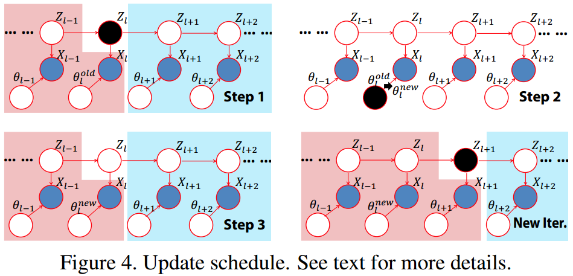

### 实验结果

下图展示的是：参考影像--文献[16]重建的深度图--文献[24]重建的深度图。可以看到，基于像素级视点选择的深度估计，容易得到更连续、更准确的深度图。

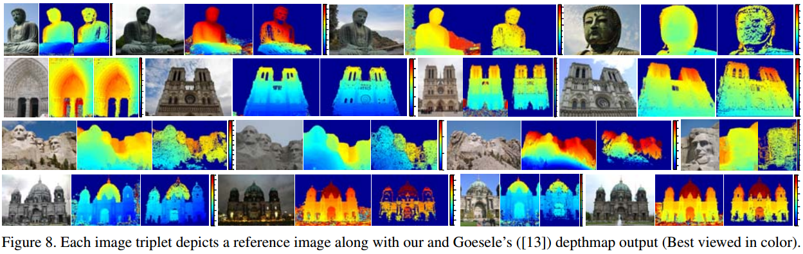

下面是VisualSFM、MVE、COLMAP和Pix4D的重建效果，参考文献[25]。

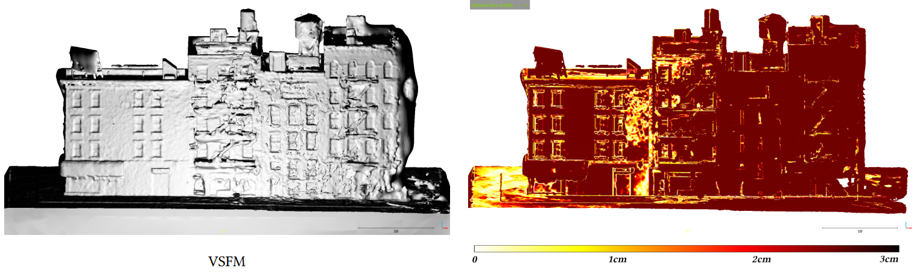

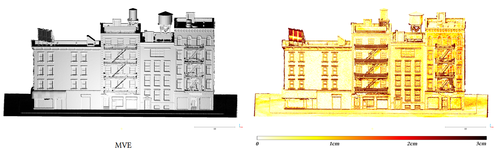

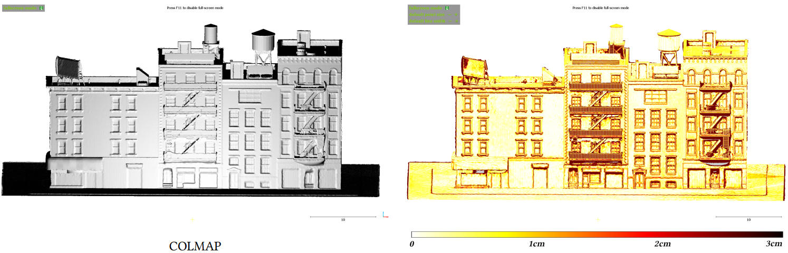

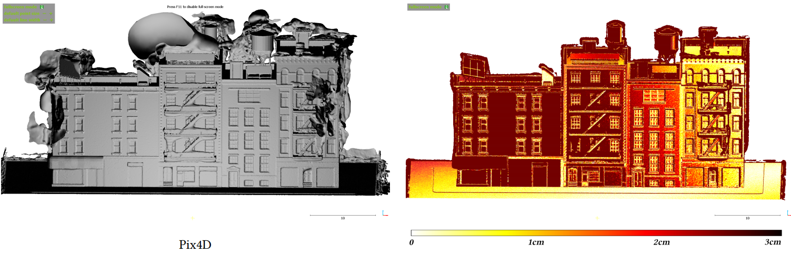

## 读书报告结论

* 基于像素级视点选择的多视深度估计算法，鲁棒性强，精度高。
* 在不考虑Mesh生成算法下，COLMAP是当前流行的开源系统中，GPU加速效果最好，精度最高的MVS系统。
* MVE提供的FSSR网格重建算法优于COLMAP使用的PoissonRecon。

# 利用 Smart3D 软件进行3D建模

分别使用“仅下视影像”和“下视影像+倾斜影像”两组数据，利用Smart3D软件进行三维模型重建。

## 测试数据集

**下视影像**

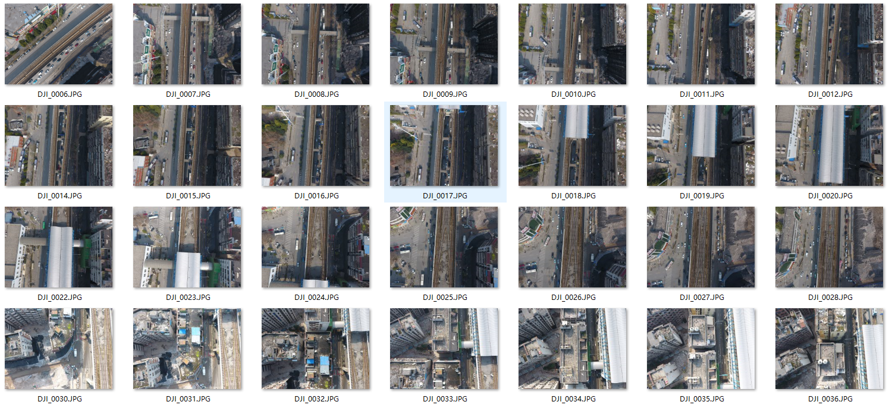

**倾斜影像-45°横向**

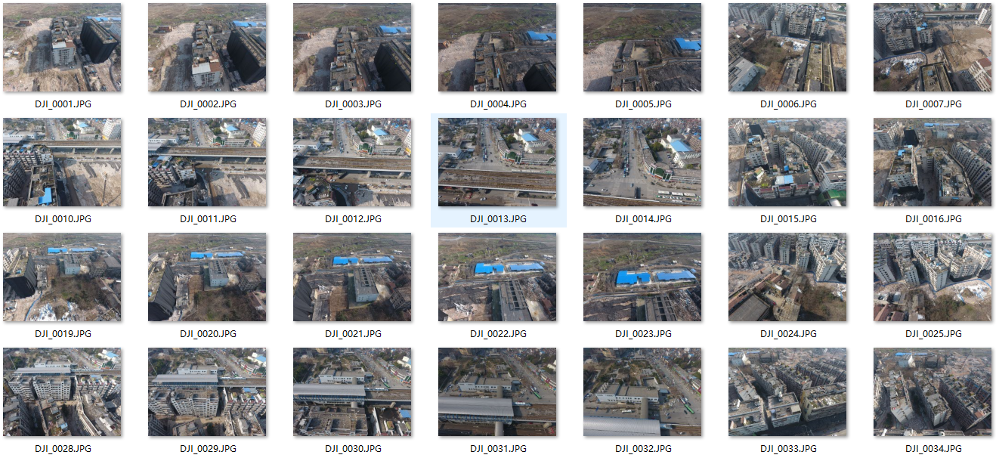

**倾斜影像-45°纵向**

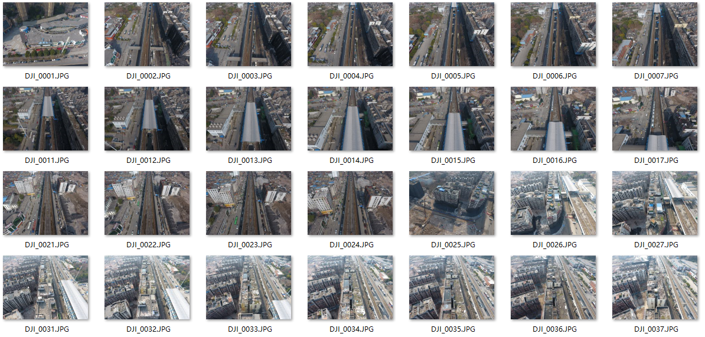

## 处理结果

### 飞行轨迹

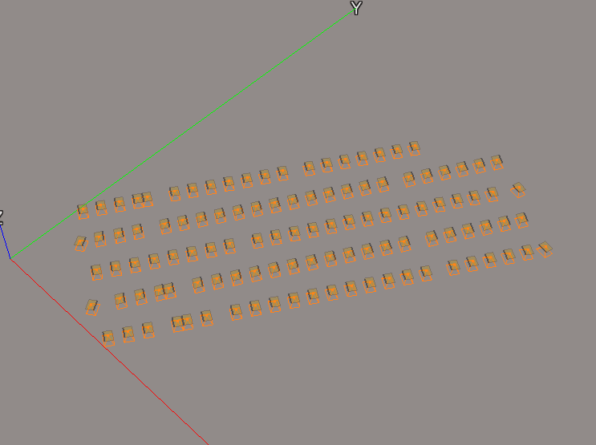

该模型的原始影像拍摄过程中，无人机飞行轨迹是传统的航飞轨迹，这种规则的轨迹便于构建地图（便于产生正射影像），但不适合用于三维建模。一些用于三维建模的无人机路径规划算法已经提出，可参考文献[26-27]。

下图是文献[27]的路径规划方案：

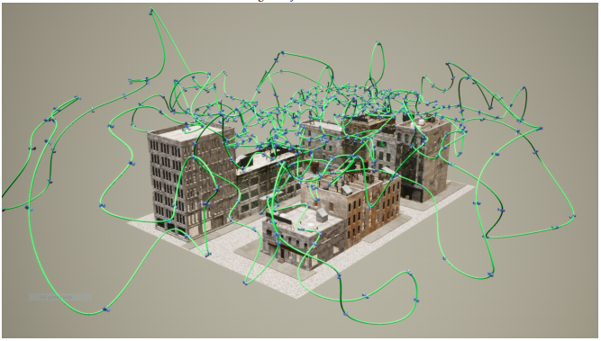

### 模型视图

下面两个视图，第一幅影像是“仅使用下视影像”构建的模型截图，第二幅影像是“使用下视影像+倾斜影像”构建的模型截图。

使用倾斜影像，能得到更高的侧面精度。

#### 模型视图1

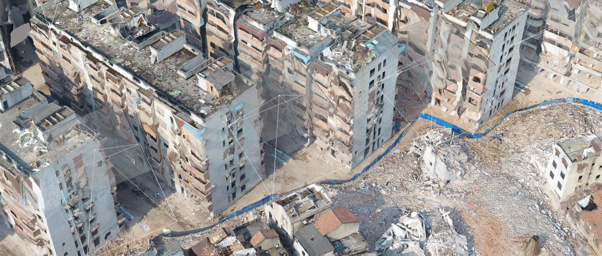

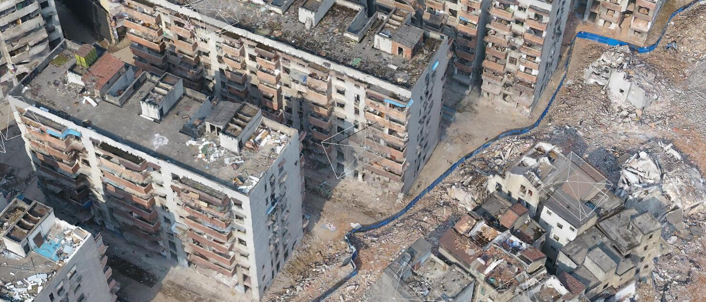

#### 模型视图2

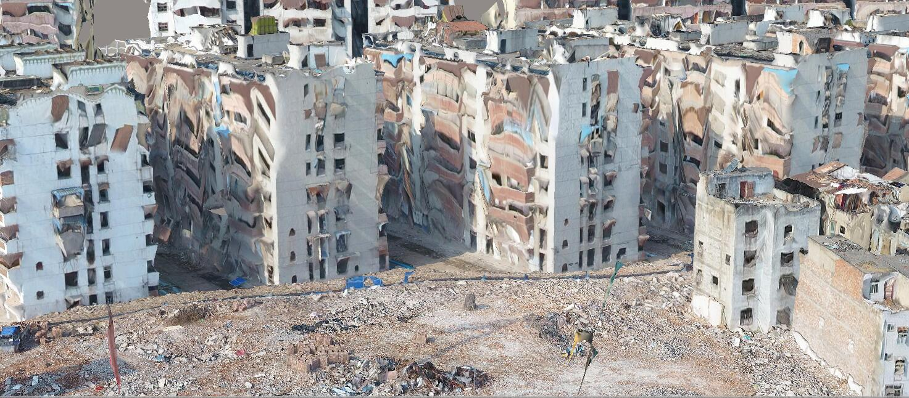

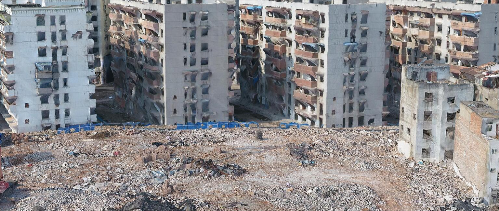

# 参考文献

> [1] 《State of the Art in High Density Image Matching》
>  [2] 《Multi View Geomery in Computer Vison》 **MVG推荐教程**
>  [3] 《Multi-View Stereo: A Tutorial》 **MVS推荐教程**
>  [4] 《Scale Robust Multi View Stereo》
>  [5] 《Using Multiple Hypotheses to Improve Depth-Maps for Multi-View Stereo》
>  [6] 《Real-time Plane-sweeping Stereo with Multiple Sweeping Directions》
>  [7] 《Multi-View Stereo: Redundancy Benefits for 3D Reconstruction》
>  [8] 《Accurate, Dense, and Robust Multi-View Stereopsis》
>  [9] 《Progressive Prioritized Multi-view Stereo》
>  [10] 《Multi-View Stereo for Community Photo Collections》
>  [11] 《Accurate and Efficient Stereo Processing by Semi-Global Matching and Mutual Information》
>  [12] 《Stereo Vision in Structured Environments by Consistent Semi-Global Matching》
>  [13] 《Stereo Processing by Semiglobal Matching and Mutual Information》
>  [14] 《PatchMatch: A Randomized Correspondence Algorithm for Structural Image Editing》
>  [15] 《PatchMatch Stereo - Stereo Matching with Slanted Support Windows》
>  [16] 《PatchMatch Based Joint View Selection and Depthmap Estimation》
>  [17] 《Pixelwise View Selection for Unstructured Multi-View Stereo》**COLMAP算法论文**
>  [18] 《Markov Random Field Modeling in Image Analysis》
>  [19] 《A View of The EM Algorithm That Justifies Incremental, Sparse, and Other Variants》
>  [20] 《Variational Inference: Areview for Statistcians》
>  [21] 《A Tutorial on Variational Bayesian Inference》
>  [22] 《Operator Variational Inference》
>  [23] 《Pattern Recognition and Machine Learning》
>  [24] 《Multi-View Stereo for Community Photo Collections》 **MVE算法论文**
>  [25] 《Supplementary Material: Aerial Path Planning for Urban Scene Reconstruction: A Continuous Optimization Method and Benchmark》 **MVE无人机路径规划的附属资料**
>  [26] 《Submodular Trajectory Optimization for Aerial 3D Scanning》
>  [27] 《Aerial Path Planning for Urban Scene Reconstruction: A Continuous Optimization Method and Benchmark》
