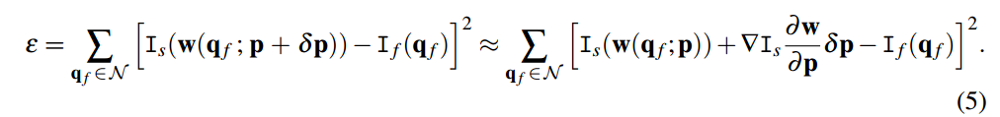
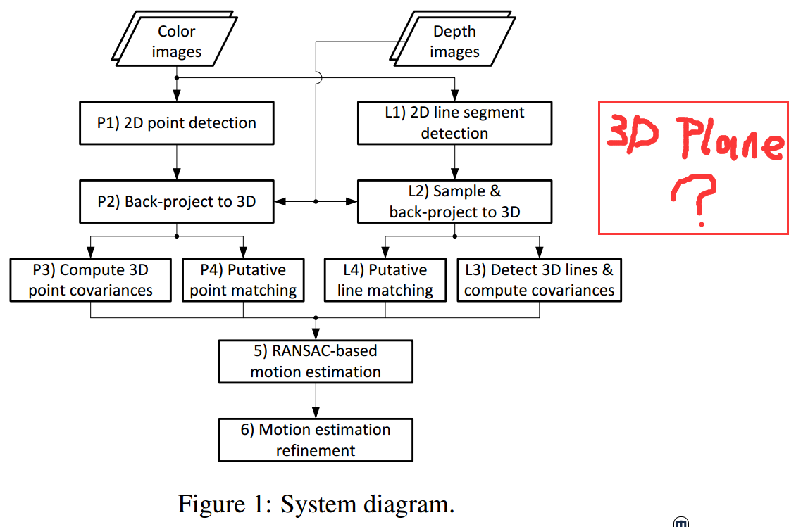
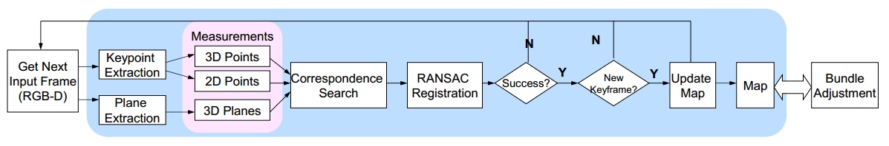
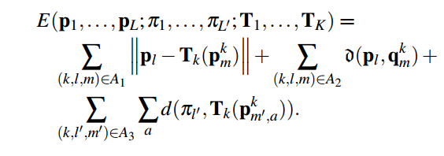
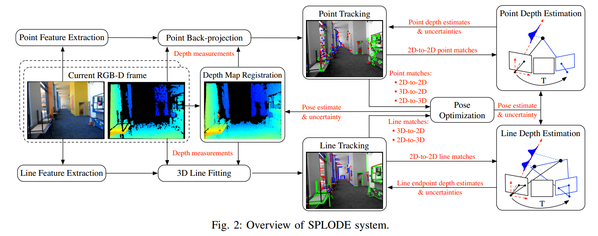
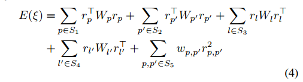
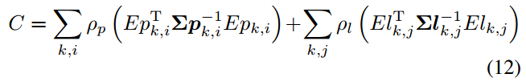
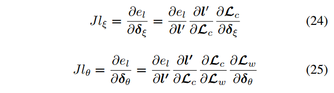

# 用于室内场景的点线面混合特征里程计   Hybrid Visual Odometry for Indoor Scene Using Point Line and Plane Features

在2D影像中，难于发现平面特征，但在RGB-D深度影像中，却能提取出平面。在室内场景中，无纹理的平面特征无处不在，传统算法没充分利用。

利用点、线特征的里程计，能够利用局部的二维信息，但忽略了蕴涵在点线之间的共面约束关系，在室内场景中存在大量的共面约束有待利用。

在过去，从2D影像中提取平面是困难的，因为许多平面往往不具有明显的特征，只含有微弱的纹理和光照变化。随着神经网络算法的发展，一些从单张影像上估计深度和提取平面的算法开始涌现，这些算法定性地研究了影像中的几何结构；一些算法尝试仅利用神经网络来估计位姿，但

> 用于RGB-D相机的点线面混合特征里程计
>  该思路已经出现在《Probabilistic RGB-D Odometry based on Points, Lines and Planes Under Depth Uncertainty》（Robotics and Autonomous Systems June 2018 ）中
>  现在的想法是，利用深度学习，从单张RGB影像中发现疑似平面的区域，并给区域一个平面概率，从多张影像中，对平面区域联合估计。
>  最终形成稳定的平面观测，利用平面约束的光度平差来准确估计位姿变化。

联合点线面特征的里程计，通过深度影像的梯度提取平面区域，将3D平面的参数作为观测值，与特征点、特征线共同估计位姿。

## State of the Art

### 《Plane-based Odometry using an RGB-D Camera》（BMVC 2013）
首次考虑了面元作为观测条件，先通过少数点、面特征来粗略估计相机位置，然后通过平面区域的光度变化来优化位置。

在代价函数中只考虑了光度误差，没有利用RGB-D相机提供的深度信息，没有考虑几何误差，在优化阶段没有利用点、线特征。

> 使用光度误差时，基于一种非常强的假设，它要求物体是朗伯的，且环境中光照分布均匀。

### 《Robust RGB-D Odometry Using Point and Line Features》（ICCV 2015）

先从2D影像中提取点线特征，并利用深度图将特征投影到3D空间，再在3D空间中构建观测误差函数。

结合了点、线特征，给出了基于几何误差的联合误差函数。

### 《Pinpoint SLAM: A hybrid of 2D and 3D simultaneous localization and mapping for RGB-D sensors》(ICRA 2016)

对于每一帧RGB-D影像，先提取特征点和平面。拥有有效深度的特征点成为3D特征点，没有有效深度的特征点成为2D特征点。在地图与影像间，匹配特征点和平面，寻找他们的匹配关系。接着使用这些匹配关系，进行RANSAC配准，如果成功则将当前帧插入地图。
光束法平差并行与此进程。

误差函数考虑了3D特征点、2D特征点和3D平面。

没有考虑线特征。只考虑了平面的几何误差，没有考虑平面的光度误差。在应对高纹理的光滑表面时，光度误差常常是一种优秀的测量手段。

### 《SPLODE: Semi-Probabilistic Point and Line Odometry with Depth Estimation from RGB-D Camera Motion》（IROS 2017）

文章给出了一种基于点线特征的里程计，同时利用了深度和影像信息。

思路与流程是ICCV2015与ICRA2016的结合。

在ICCV2015的基础上，在误差函数中使用了2D特征。

没有考虑面特征。2D线-2D线的匹配关系被用于深度测量，没有用来进行位姿估计。

### 《Robust Visual SLAM with Point and Line Features》（IROS 2017）

文章在ORB-SLAM系统的基础上，加入了线特征。

联合点线的重投影误差函数：

### 《Probabilistic RGB-D Odometry based on Points, Lines and Planes Under Depth Uncertainty》（Robotics and Autonomous Systems June 2018 ）

文章已经完成了我想要做的工作……

## 使用平面特征的优势

### 利用低纹理区域

基于特征点和特征线的方法，需要对其2D位置进行准确观测；光流法克服了这一缺点，能在特征不明显但具有光度变化的表面上估计运动方向，但光流法鲁棒性极差，因为环境对光流的影响是剧烈的。

通过对面特征进行观测，可以有效利用室内场景中存在的大范围低纹理区域。

### 更精确、更鲁棒

平面特征相较于点、线特征，由于具有一整块观测区域，噪声更小、更稳定。

## 算法流程

* 在RGB影像上提取特征点、特征线，并记所有特征为2D特征
* 将具有有效深度的特征点、特征线记为附加3D特征
* 在D通道上提取特征平面
* 利用特征特征点、特征线、特征平面的匹配关系进行平差，估计位姿

## 地图（里程计不考虑）

参数包含：

* 3D点
* 3D线
* 3D面
* 影像位姿

每张相片的观测值：

* 2D点+（深度）
* 2D线+（深度）
* 2D面+深度=3D面

## 误差函数

深度相机中，单纯考虑2D特征的匹配关系，忽略了D通道提供的深度信息。深度相机也不能为每一个特征都提供深度，对于无法估计深度的区域，只能利用2D信息。

由于深度相机的D通道精度较低，将深度信息加入误差函数，是否有助于姿态估计呢？还是说像传统算法一样，只将深度信息用于粗差剔除？

误差函数应当包含下列项（参考影像与源影像）

* 点误差：
  * 2D点-2D点的误差（RGB影像与RGB影像）
  * 2D点-3D点的误差（RGB影像与RGBD影像）
  * 3D点-3D点的误差（RGBD影像与RGBD影像）
* 线误差：
  * 2D线-2D线的误差（RGB影像与RGB影像）
  * 2D线-3D线的误差（RGB影像与RGBD影像）
  * 3D线-3D线的误差（RGBD影像与RGBD影像）
* 面误差：
  * 3D点-3D面的误差（RGBD影像与3D观测面）
  * 3D线-3D面的误差（RGBD影像与3D观测面）
  * 平面的光度误差（RGB影像与RGB影像）（是否应该仅用于梯度最大处？）
  * 平面的几何误差（3D观测面与3D观测面）

  # Tips

  > 如果觉得里程计太简单……可以做SLAM系统……

  > 用于RGB-D相机的点线面混合特征SLAM系统   Hybrid SLAM for RGB-D Cameras Using Point-Line-Plane Feature
