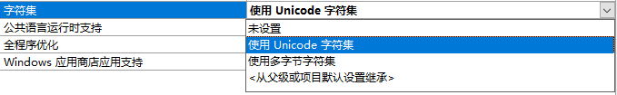

# CHAR , WCHAR and TCHAR

窄字符(ASCII)和宽字符(Unicode)的转换，我在网上找了一堆，全是自己写了一大堆代码，为什么不介绍微软自带的宏呢？我不懂……

先说在VC++中的字符集与**TCHAR**的关系：



当选择**使用Unicode字符集**时，**TCHAR**等价于**wchar_t**;

当选择**使用多字节字符集**时，**TCHAR**等价于**char**

**TCHAR**是VC++定义的一个宏，用来自适应字符集的变化。

所以字符集的转换，其实就是**char**和**wchar_t**的转换。在ATL库中，已经定义了这种转换，可以参考微软官方文档：

> [ATL and MFC String Conversion Macros](https://msdn.microsoft.com/zh-cn/library/87zae4a3)

引用头文件**AtlConv.h**，执行下面代码来转换字符串：

```cpp
#include <tchar.h>
#include <atlconv.h>

void main()
{
  //转换宏初始化
	USES_CONVERSION;

	char * str = "Miowu！嘿嘿！";
  // ascii to wide
	wchar_t * wstr = A2W(str);
  // wide to ascii
	char * _str = W2A(wstr);
}
```
