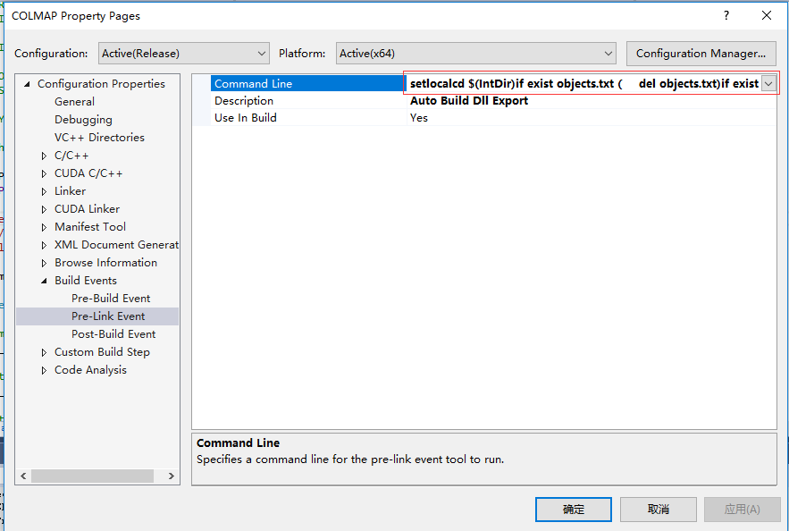

# Not Use __declspec dllimport dllexport in VC++ code

## 使用cmake来避免使用导出符号

### 取消全局优化


### 建立模块文件的宏
为了自动导出所有模块，在编译器链接操作以前，定义如下的宏：

```bat
setlocal
cd $(IntDir)
if exist objects.txt (
	del objects.txt
)
if exist exports.def (
	del exports.def
)
for /r %%i in (*.obj) do (
	echo %%i>>objects.txt
)
$(CMAKE_DIR)\cmake.exe -E __create_def exports.def objects.txt
endlocal
```
> 定义了常量宏
> **CMAKE_DIR** 要使用较新版本的CMake

在这里输入以上的代码：


### 链接导出符号文件

上面会产生一个exports.def模块定义文件，将该文件输入给VS的连接器：


## 以下是废弃的内容

VS 2015 Update 2 后的版本 加入了新的参数
**/WHOLEARCHIVE**

> https://docs.microsoft.com/en-us/cpp/build/reference/wholearchive-include-all-library-object-files?view=vs-2017

> 在VC++编程中，如果要创建一个DLL，提供可导入的LIB文件，必须在要导出的变量、函数、类的前面
> 添加__declspec(dllexport)。
>
> GCC编译器中的代码却不需要这样做，GCC默认导出所有符号。对于一些LINUX上的工程，如果要移植到Windows上，添加导出符号的工作令人沮丧。

# 在VC++中使用导出符号

这是普遍情况下，如何导出一个DLL：

首先创建一个“定义导出符号”的头文件**Standard.h**，这个头文件几乎会被其它所有文件引用。这个文件的作用，是使**TESTDLL_API**成为一个自适应的符号，在创建DLL的工程中，成为导出符号，在使用DLL的工程中，成为导入符号。

```cpp
#pragma once

#ifdef WIN32
#	ifdef TESTDLL_EXPORTS
#		define TESTDLL_API __declspec(dllexport)
#	else
#		define TESTDLL_API __declspec(dllimport)
#	endif
#else
#	define TESTDLL_API
#endif
```

说说这些宏的作用：

* **WIN32**：在WIN32编译环境中，**TESTDLL_API**会被解析为导出符号，其它编译环境中被忽略。
* **TESTDLL_EXPORTS**：DLL导出工程需要定义的宏，若定义**TESTDLL_EXPORTS**，**TESTDLL_API**为导出符号，反之，TESTDLL_API变成导入符号。
* **TESTDLL_API**：导入符号/导出符号。

下面定义类，注意需要在类前，加导入导出符号：
```cpp
#pragma once
#include "Standard.h"

namespace Sgg4DRecon
{
	class TESTDLL_API TestClass
	{
	public:
		TestClass();
		~TestClass();
	};
}
```

# dumpbin.exe & lib.exe

用VS自带的dumpbin和lib工具，可以完全代替导入导出符号，这让移植简单了许多。


工具用法：

dumpbin /exports xxx.dll > xxx.def

lib /def:xxx.def /machine:x86 /out:xxx.lib 或 lib /def:xxx.def /machine:x64 /out:xxx.lib

在设置-->生成事件-->后期生成事件中，添加命令行，下面是32位的，64位改为
**/machine:x64**：

```Shell
dumpbin.exe /exports "$(TargetPath)" > "$(TargetDir)$(TargetName).def"
lib.exe /def:"$(TargetDir)$(TargetName).def" /machine:x86 /out:"$(TargetDir)$(TargetName).lib"
```

经过试验，上面的方法只能在添加了导入导出符号的Dll中使用。**dumpbin.exe /exports**只会输出被导出的符号，我们只能进一步探究如何使用dumpbin。

除此之外，我们还要了解如何书写def文件。

dumpbin /SYMBOLS $(Platform)\$(Configuration)\mdb.obj | findstr /R "().*External.*mdb_.*" > $(Platform)\$(Configuration)\mdb_symbols
(echo EXPORTS & for /F "usebackq tokens=2 delims==|" %%E in (`type $(Platform)\$(Configuration)\mdb_symbols`) do @echo  %%E) > $(Platform)\$(Configuration)\lmdb.def

CMAKE提供了一种解决方案，参考网站：

> https://blog.kitware.com/create-dlls-on-windows-without-declspec-using-new-cmake-export-all-feature/
> https://bitbucket.org/vlasovmaksim/cmake_windows_export_all_symbols/overview
