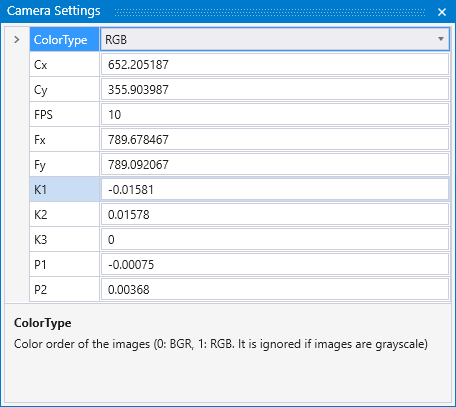
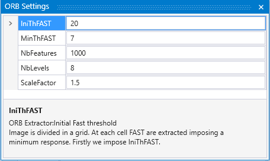

# JMosaic 使用说明

## 工程管理

一个JMosaic工程负责处理一次外业作业。在使用JMosaic前，需将无人机等影像捕捉设备的输出路径，定向至“工作目录”。

### 新建工程

### 保存工程

### 打开工程

### 导入导出YAML

### 工程参数

## 视图

### 平移、缩放与旋转

### OpenGL参数

### 窗体

## SLAM模块

### 相机参数

点击**View-->Windows-->Camera Settings**打开参数设置窗口

* **色彩制式** RGB BGR 可选，
* **Cx**
* **Cx**
* **Cx**
* **Cx**
* **Cx**
* **Cx**
* **Cx**

### ORB参数

### 初始化与重置

### 开始与停止

### 保存数据

#### 轨迹数据

#### 半密集点云

## 拼图模块

### 准实时拼图

### 离线快速拼图
