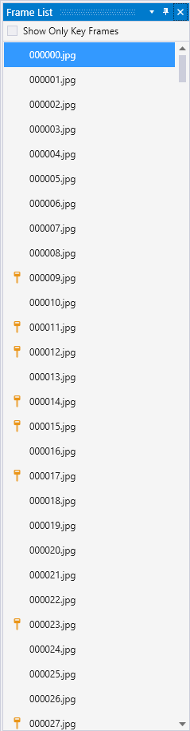
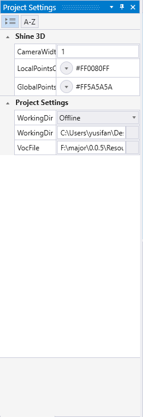

# JMosaic 使用说明

# 软件概述

# 系统安装与运行
## 系统要求

## 软件安装
软件安装步骤如下所示
### 双击应用程序，选择程序安装的目录（可自定义，默认在安装在C盘），点击Next

### 选择创建快捷方式的文件夹，点击Next

### 选择创建桌面快捷方式，点击Next

### 确认安装设置无误后，点击Install开始安装程序

### 等待安装

### 点击Finish即可完成安装

### 进入程序，显示如下界面则安装成功

## 工程管理

一个JMosaic工程负责处理一次外业作业。在使用JMosaic前，需将无人机等影像捕捉设备的输出路径，定向至“工作目录”。

### 新建工程
点击**File-->New**创建新工程

* **Project Directory** 工程和输出文件所保存的目录
* **Project File** 工程参数文件
* **Working Directory** 工作目录
* **Vocabulary File** ORB词汇文件
* **Camera File** 相机文件
* **Working Mode** 可选Online或Offline两种模式。Online模式每次都会追踪最新的影像；OffLine模式追踪工作目录中的每一张影像。

### 打开工程
点击**File-->Open**，选择工程.cfg文件，打开已有工程

### 保存工程
点击**File-->Save**保存当前工程

### 导入导出YAML
点击**File-->Import-->YAML File**导入YAML文件

点击**File-->Export-->YAML File**导出YAML文件

### 导入导出工程参数
点击**File-->Import-->Settings File**导入工程参数文件

点击**File-->Export-->Settings File**导出工程参数文件

## 视图
View菜单可以控制显示以下视图

* **Frame List** 帧列表
* **Frame Viewer** 帧浏览
* **Log Viewer** 输出日志
* **Shine 3D Viewer** 3D浏览
* **Camera Settings** 相机参数设置
* **ORB Settings** ORB参数设置
* **Mosaic Settings** 拼接参数设置
* **Project Settings** 工程参数设置

### 平移、缩放与旋转

### OpenGL参数

## SLAM模块

### 相机参数

点击**View-->Windows-->Camera Settings**打开参数设置窗口

* **色彩制式** 可选RGB或BRG
* **Cx** 像主点在图像坐标系下u轴的坐标（单位为像素）
* **Cy** 像主点在图像坐标系下v轴的坐标（单位为像素）
* **FPS** 每秒帧数
* **Fx** x方向的焦距（单位为像素）
* **Fy** y方向的焦距（单位为像素）
* **K1 K2 K3** 相机成像径向畸变参数
* **P1 P2** 相机成像切向畸变参数

### ORB参数

点击**View-->Windows-->ORB Settings**打开参数设置窗口

* **IniThFAST** 检测FAST角点的阈值
* **MinThFAST** 在iniThFAST没有检测到角点的时候降低的阈值
* **NbFeatures** 特征点的个数
* **NbLevels** 构造金字塔的层数
* **ScaleFactor** 金字塔中相邻层图像的比例系数

### 初始化与重置
单击菜单栏UAV-->Initialize SLAM或者点击按钮即可初始化或重置SLAM系统。

### 开始与停止
单击菜单UAV-->Begin Tracking或者点击按钮
开始SLAM跟踪。

单击菜单UAV-->Stop Tracking或者点击按钮停止SLAM跟踪。
### 保存数据

点击下图中对应按钮可以保存SLAM数据
#### 轨迹数据

#### 半密集点云

## 拼图模块

### 准实时拼图

### 离线快速拼图

### 开始与停止
开始拼图

停止拼图

### 数据保存

保存拼接图

