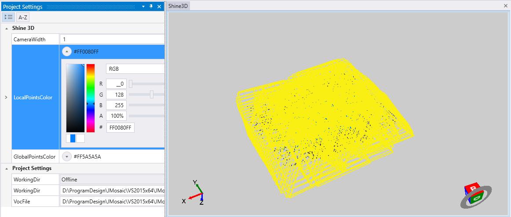

# Jade Mosaic 使用说明


<!-- TOC depthFrom:1 depthTo:6 withLinks:1 updateOnSave:1 orderedList:0 -->

- [Jade Mosaic 使用说明](#jade-mosaic-使用说明)
- [软件概述](#软件概述)
- [系统安装与运行](#系统安装与运行)
	- [系统要求](#系统要求)
	- [软件安装](#软件安装)
		- [双击应用程序，选择程序安装的目录（可自定义，默认在安装在C盘），点击Next](#双击应用程序选择程序安装的目录可自定义默认在安装在c盘点击next)
		- [选择创建快捷方式的文件夹，点击Next](#选择创建快捷方式的文件夹点击next)
		- [选择创建桌面快捷方式，点击Next](#选择创建桌面快捷方式点击next)
		- [确认安装设置无误后，点击Install开始安装程序](#确认安装设置无误后点击install开始安装程序)
		- [等待安装](#等待安装)
		- [点击Finish即可完成安装](#点击finish即可完成安装)
		- [进入程序，显示如下界面则安装成功](#进入程序显示如下界面则安装成功)
	- [打开帮助](#打开帮助)
- [标准工作流程](#标准工作流程)
	- [工程管理](#工程管理)
		- [新建工程](#新建工程)
		- [打开工程](#打开工程)
		- [保存工程](#保存工程)
		- [导入导出YAML](#导入导出yaml)
		- [导入导出工程参数](#导入导出工程参数)
	- [视图](#视图)
		- [平移、缩放与旋转](#平移缩放与旋转)
		- [OpenGL参数](#opengl参数)
	- [SLAM模块](#slam模块)
		- [相机参数](#相机参数)
		- [ORB参数](#orb参数)
		- [初始化与重置](#初始化与重置)
		- [开始与停止](#开始与停止)
		- [保存数据](#保存数据)
			- [轨迹数据](#轨迹数据)
			- [稀疏点云](#稀疏点云)
			- [半密集点云](#半密集点云)
	- [拼图模块](#拼图模块)
		- [实时拼图](#实时拼图)
		- [开始与停止](#开始与停止)
		- [数据保存](#数据保存)
- [附录](#附录)
	- [附录1 YAML文件格式](#附录1-yaml文件格式)
	- [附录2 Trajectory文件格式](#附录2-trajectory文件格式)

<!-- /TOC -->

# 软件概述
Jade Mosaic 用于实时无人机定位与成图。软件包括以下主要功能：

* 实时相对定位
* 准实时半密集点云生成
* 实时下视影像拼接


# 系统安装与运行

## 系统要求

项|最低配置|推荐配置
--|--|--
操作系统  |Windows x64   |  Windows x64
CPU  |Core i5 3500   |  Core i7 3770 以上
内存  |8 GB   |16 GB 以上
显卡  |支持Dx 11.0 | NVIDIA GTX 650 以上

注：

> 由于半密集匹配采用GPU加速，GPU性能直接影响半密集匹配阶段的效率。过小的内存将造成频繁的硬盘读写，建议用户优先考虑升级内存。

## 软件安装
软件安装步骤如下所示
### 双击应用程序，选择程序安装的目录（可自定义，默认在安装在C盘），点击Next

### 选择创建快捷方式的文件夹，点击Next

### 选择创建桌面快捷方式，点击Next

### 确认安装设置无误后，点击Install开始安装程序

### 等待安装

### 点击Finish即可完成安装

### 进入程序，显示如下界面则安装成功


## 打开帮助

点击**Help-->Documentation**可打开本帮助。


# 标准工作流程

* 新建工程

* 启动SLAM进程

* 导出轨迹和稀疏点云

* 导出正射图和半密集点云


## 工程管理

一个JMosaic工程负责处理一次外业作业。在使用JMosaic前，需将无人机等影像捕捉设备的输出路径，定向至“工作目录”。

### 新建工程
点击**File-->New**创建新工程。


* **Project Directory** 工程和输出文件所保存的目录
* **Project File** 工程参数文件
* **Working Directory** 工作目录
* **Vocabulary File** ORB词汇文件
* **Camera File** 相机文件
* **Working Mode** 可选Online或Offline两种模式。Online模式每次都会追踪最新的影像；OffLine模式追踪工作目录中的每一张影像。


### 打开工程
点击**File-->Open**，或工具按钮，选择工程.cfg文件，打开已有工程。


### 保存工程
点击**File-->Save**保存当前工程，
点击
**File-->Save As...**
另存当前工程。


### 导入导出YAML
程序使用OpenCV支持的YAML文件来保存相机参数、ORB参数和拼图参数。这些参数允许用户从标准YAML文件导入，用户可参考YAML官网了解文件格式，本软件使用的参数格式见附录1。

> http://yaml.org/

点击**File-->Import-->YAML File**导入YAML文件。


点击**File-->Export-->YAML File**导出YAML文件。


### 导入导出工程参数

工程参数是与工程的目录设置、显示设置等参数。工程参数不支持用户自定义修改。

点击**File-->Import-->Settings File**导入工程参数文件。


点击**File-->Export-->Settings File**导出工程参数文件。


## 视图
View菜单可以控制显示以下视图，用户可关闭一些不必要的窗口，当需要这些窗口时，从View菜单中打开。有表示当前窗口已打开。


* **Frame List** 帧列表


* **Frame Viewer** 帧浏览


* **Log Viewer** 输出日志


* **Shine 3D Viewer** 3D浏览


* **Project Settings** 工程参数设置


* **Camera Settings** 相机参数设置

* **ORB Settings** ORB参数设置

* **Mosaic Settings** 拼接参数设置

### 平移、缩放与旋转
Shine3D窗口是实时3D浏览器。在Shine3D窗口中，按住鼠标中键并移动鼠标可平移视点；按住鼠标右键并移动鼠标可旋转视点；滚动鼠标滚轮可进行缩放。


### OpenGL参数

OpenGL参数是Shine3D显示界面的一些可视化效果参数，如：

* **CameraWidth**：相机宽度
* **LocalPointsColor**：局部点云色彩
* **GlobalPointsColor**：全局点云色彩

Shine3D视图中的相框大小和点云颜色，可通过**Project Settings**窗口设置。

在下图中，**CameraWidth**参数设置过大，无法分辨每帧具体位置，可适当减小参数值方便观察。




## SLAM模块

### 相机参数


点击**View-->Windows-->Camera Settings**打开参数设置窗口。

* **色彩制式** 可选RGB或BRG
* **Cx** 像主点在图像坐标系下u轴的坐标（单位为像素）
* **Cy** 像主点在图像坐标系下v轴的坐标（单位为像素）
* **FPS** 每秒帧数
* **Fx** x方向的焦距（单位为像素）
* **Fy** y方向的焦距（单位为像素）
* **K1 K2 K3** 相机成像径向畸变参数
* **P1 P2** 相机成像切向畸变参数

### ORB参数


点击**View-->Windows-->ORB Settings**打开参数设置窗口。

* **IniThFAST** 检测FAST角点的阈值
* **MinThFAST** 在iniThFAST没有检测到角点的时候降低的阈值
* **NbFeatures** 特征点的个数
* **NbLevels** 构造金字塔的层数
* **ScaleFactor** 金字塔中相邻层图像的比例系数

### 初始化与重置
单击菜单栏**UAV-->Initialize SLAM**或者点击按钮即可初始化或重置SLAM系统。


### 开始与停止
单击菜单**UAV-->Begin Tracking**或者点击按钮
开始SLAM跟踪。


单击菜单**UAV-->Stop Tracking**或者点击按钮停止SLAM跟踪。


### 保存数据

在停止追踪过程后，可保存结果。

#### 轨迹数据
点击**File-->Export-->Trajectory File**导出轨迹数据。


#### 稀疏点云

点击**File-->Export-->Sparse Point Cloud**导出稀疏点云。


#### 半密集点云

点击**File-->Export-->Semi-Dense Cloud**导出半密集点云。
生成半密集点云需要等待数分钟。


## 拼图模块

### 实时拼图

离线模式中，拼图不会随着追踪线程执行，用户需要在SLAM过程完成后，单独执行一次拼图模块；在线模型中，拼图会稍延迟于追踪线程执行，延迟量**Delay Number**会影响拼图精度，在**Mosaic Settings**窗口中可以设置该值。

拼图系统会首先初始化一个拼图平面，这个平面由刚开始进入系统的数个关键帧决定，准备量**Prepare Number**是这些关键帧的个数。


* **Delay Number** 延迟量
* **Prepare Number** 准备量

### 开始与停止
点击**Mosaic-->Start Mosaicing**开始拼图。


点击**Mosaic-->Stop Mosaicing**停止拼图。


### 数据保存

点击**Mosaic-->Stop Mosaicing**保存拼接图。


# 附录

## 附录1 YAML文件格式

>YAML版本 1.0

YAML项|软件参数
--|--
Camera.fx | x方向的焦距
Camera.fy | y方向的焦距
Camera.cx | 像主点在图像坐标系下u轴的坐标
Camera.cy | 像主点在图像坐标系下v轴的坐标
Camera.k1 | 相机成像径向畸变参数
Camera.k2 | 相机成像径向畸变参数
Camera.k3 | 相机成像径向畸变参数
Camera.p1 | 相机成像切向畸变参数
Camera.p2 | 相机成像切向畸变参数
Camera.fps | 每秒帧数
Camera.RGB | 色彩制式 1：RGB 2:BGR
ORBextractor.nFeatures  |  特征点的个数
ORBextractor.scaleFactor  |  金字塔中相邻层图像的比例系数
ORBextractor.nLevels  |  构造金字塔的层数
ORBextractor.iniThFAST  |  检测FAST角点的阈值
ORBextractor.minThFAST  |  在iniThFAST没有检测到角点的时候降低的阈值
Mosaic.PrepareNumber  |  准备量
Mosaic.DelayNumber  |  延迟量

## 附录2 Trajectory文件格式

文件的每行表示一个关键帧的时间戳、位置与姿态，时间戳的单位为秒，位置采用XYZ坐标表示，姿态采用四元素表示，各个参数间用空格隔开。

TimeStamp|X|Y|Z|a|b|c|d
--|--|--|--|--|--|--|--|

其中abcd的关系，有公式：

$$ Q = a + bi + cj + dk $$

下面是一段文件：

```
63668968631.917809 0.0000000 0.0000000 0.0000000 0.0000000 0.0000000 0.0000000 1.0000000
63668968632.074059 0.0054926 0.1156300 0.0046731 -0.0003312 0.0009513 0.0017288 0.9999980
63668968632.152191 0.0072366 0.1747110 0.0073475 -0.0001073 0.0011627 0.0029318 0.9999950
63668968632.386559 0.0155119 0.3629327 0.0177936 0.0006567 0.0034897 0.0017949 0.9999921
```
