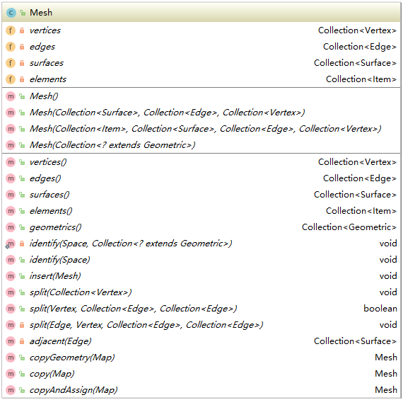
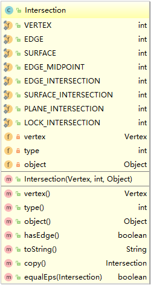

> 为了更好地理解交互式3D建模软件的构成，我先梳理B-Processor中重要的类和方法。
> 所有的UML图我都放在了UML文件夹中

**目录**

- [B-Processor的框架结构](#bpframe)

- [空间数据结构](#spacestructure)

- [绘图工具](#tools)

# B-Processor的框架结构

## bprocessor-主框架

b-processor中包含程序的主方法，另有重要的子空间：

* model：3D模型核心
* gl：openGL接口及模型工具
* gui：用户图形界面

## model-模型

所有模型都继承自实体类Entity，它包含了空间物体最一般的方法，相当于一个命名标签。

几何体的构建和传统3D系统类似。基础点边面结构、联合、辅助图形

* Vertex-Edge-Surface
* Item
  * Space
  * Instance
* Constructor

## undo/redo-撤销/重做机制

在Project类中，有两个栈，用于保存撤销重做的属性参数。在每一次可撤回操作中，所有的属性都被保存。下面这段代码大致解释了撤销原理：

    //保存当前状态
    public void checkpoint() {
        //将目前所有接口自Parametic的实体参数化
        final Bmodel state = Persistence.externalize();
        if (state != null) {
            this.redoStack.clear();
            if (this.currentState != null) {
                this.undoStack.push(this.currentState);
                if (this.undoStack.size() > 5) {
                    this.undoStack.remove(0);
                }
            }
            this.currentState = state;
        }
    }
    //撤销至上一状态
    public void undo() {
        if (this.canUndo()) {
            if (this.currentState != null) {
                this.redoStack.push(this.currentState);
            }
            this.setState(this.currentState = this.undoStack.pop());
            Selection.primary().clear();
        }
    }
    //重做至下一状态
    public void redo() {
        if (this.canRedo()) {
            if (this.currentState != null) {
                this.undoStack.push(this.currentState);
            }
            this.setState(this.currentState = this.redoStack.pop());
            Selection.primary().clear();
        }
    }

这种撤销重做机制对内存的开销是巨大的，特别是在模型较大的时候，大多数时候，我们更倾向于保存一次操作对文档产生的影响，而不是保存整个文档。

在MPC中，还是继续使用MPC自带的Document来保存操作，这里介绍重做机制只是帮助理解。

## gl.tool-交互工具
各类画笔、拓扑工具被放置在了gl包中。抽象画笔工具是几何工具和拓扑工具的基类。

## 动画的机制

# 空间数据结构
为了实现3D交互操作，将在MPC中使用B-Processor的数据结构。

## Space

Item表示空间中的一个物件，这个物件独立于其它点线面，但它又可以拆分为点线面。

Space继承于Item，它是一个点边面的联合。

向Space中插入一个mesh的代码如下。

    public Mesh insert(Mesh mesh) {
        Collection<Vertex> vertices = new LinkedList();
        Collection<Edge> edges = new LinkedList();
        Collection<Surface> surfaces = new LinkedList();
        mesh.split(this.getVertices());
        Iterator i$ = mesh.vertices().iterator();

        while(i$.hasNext()) {
            Vertex vertex = (Vertex)i$.next();
            vertices.add(this.insert(vertex));
        }

        i$ = mesh.edges().iterator();

        while(i$.hasNext()) {
            Edge edge = (Edge)i$.next();

            try {
                edge.check();
                edges.add(this.insert(edge));
            } catch (Exception var9) {
                System.out.println("inconsistent: " + edge);
                System.out.println("   " + edge.getFrom());
                System.out.println("   " + edge.getTo());
            }
        }

        i$ = mesh.surfaces().iterator();

        while(i$.hasNext()) {
            Surface surface = (Surface)i$.next();

            try {
                surface.check();
                surfaces.add(this.insert(surface));
            } catch (Exception var8) {
                System.out.println("inconsistent: " + surface);
            }
        }

        SurfaceAnalysis analysis = new SurfaceAnalysis();
        surfaces.clear();
        surfaces.addAll(analysis.surfaceAnalysis(this, edges));
        Iterator i$ = surfaces.iterator();

        while(i$.hasNext()) {
            Surface current = (Surface)i$.next();
            Geometry.holeAnalysis(current);
        }

        i$ = mesh.elements().iterator();

        while(i$.hasNext()) {
            Item element = (Item)i$.next();
            this.add(element);
        }

        return new Mesh(surfaces, edges, vertices);
    }

## Vertex
顶点结构如常。有一个特殊的字段Corner，暂时不清楚含义。

对于每一个顶点，都可以在它最直接的上一层容器中，查找含有它的边：

    public Set<Edge> getEdges() {
        Set<Edge> result = new HashSet();
        if (this.getOwner() == null) {
            return result;
        } else {
            Collection edges = this.getOwner().getEdges();
            Iterator iter = edges.iterator();

            while(iter.hasNext()) {
                Edge current = (Edge)iter.next();
                if (current.contains(this)) {
                    result.add(current);
                }
            }

            return result;
        }
    }

同样也能通过查找它的Edge，来获取含有它的面：

    public Set<Surface> getSurfaces() {
        Set<Surface> result = new HashSet();
        Set edges = this.getEdges();
        Iterator iter = edges.iterator();

        while(iter.hasNext()) {
            Edge current = (Edge)iter.next();
            result.addAll(current.getSurfaces());
        }

        return result;
    }

## Edge
Edge包含起点和终点。

在BP中，这一结构只能描述直线段，为了克服这一缺点，在MPC中Edge应该能够兼容其它曲线表示。MPC中会支持多段直线（手绘线）、圆弧。

## Surface
Surface有一个边的集合来描述它的轮廓，有一个面的集合来描述它的洞。
如果当前的Surface是一个洞，exterior字段来记录它的外围，洞的外围有且仅有一个。

## Mesh
对于一系列点和边的集合，常常需要构建一个网格。

在向空间中插入新边时，就需要考虑构建新的网格。

    //向空间中添加边并返回产生的面片
    public static List<Surface> insertEdges(Space space, List<Edge> edges) {
        List<Surface> result = new LinkedList();
        //获取边的所有顶点
        Collection<Vertex> vertices = Edge.vertices(edges);
        //由边和顶点构成mesh
        Mesh mesh = new Mesh(new LinkedList(), edges, vertices);
        //向当前空间插入mesh
        mesh = space.insert(mesh);
        //返回新增的面片
        result.addAll(mesh.surfaces());
        return result;
    }

# 绘图工具
绘图工具要进行复杂的拓扑变换操作，例如在空间中绘制一条线段，会破坏原有线段，也会破坏原有面片，可会完全改变以前的拓扑，也可能生成全新的拓扑。

## 交点
Intersection是当前鼠标光线与空间实体的焦点，鼠标光线与空间中的点、边、面都可产生交点。这是捕捉机制的基础。目前我们只捕捉：

* 顶点
* 边
* 面
* 与边相交产生的点
* 与面相交产生的点

## 抽象画笔
抽象画笔是所有画笔类工具的基类，它的主要功能包括：

* 产生临时坐标系，用于捕捉

## 直线画笔
直线画笔是最重要3D绘图工具，下面将重点分析这个工具。

    public void onVertex() {
        //第一次单击
        if (this.start == null) {
            //current是鼠标当前的交点
            this.start = this.current;
            this.active = true;

        //第二次单击
        } else {
            //若和起点一致，添加Vertex并结束
            if (this.start.vertex().equalEps(this.current.vertex())) {
                Project.getInstance().getActiveSpace().insert(this.current.vertex());
                Project.getInstance().propagate(Project.getInstance().getActiveSpace());
                Project.getInstance().changed();
                Project.getInstance().checkpoint();
                this.cleanUp();
                return;
            }

            //添加线段
            Edge edge = new Edge(this.start.vertex(), this.current.vertex());
            List<Edge> edges = new LinkedList();
            edges.add(edge);
            //设置当前线段为活动线
            this.hooverEdge = edge;
            //将当前点设置为起点
            this.start = this.current;
            this.incident = null;
            //获取当前空间中的所有顶点
            Collection vColl = Project.getInstance().getActiveSpace().getVertices();
            //获取当前空间中的所有边
            Collection eColl = Project.getInstance().getActiveSpace().getEdges();
            //当前空间中包含了当前顶点
            //当前空间中包含了当前边
            boolean exsGeometry = this.current.type() == 1 && vColl.contains(this.current.object()) || this.current.type() == 2 && eColl.contains(this.current.object());
            //finish表示是否结束画笔工具
            //Geometry.insertEdges(edges)向当前空间插入了新线段
            boolean finish = !Geometry.insertEdges(edges).isEmpty() || exsGeometry;
            Project.getInstance().propagate(Project.getInstance().getActiveSpace());
            Project.getInstance().changed();
            Project.getInstance().checkpoint();
            if (finish) {
                this.cleanUp();
                return;
            }
        }

        this.updateConstructors();
        this.updateFeedback();
        this.editor.repaint();
        this.setTip(this.secondClickTip());
    }

## 删除
删除操作也会改变图形的拓扑，删除一条边的同时，可能会同时删除一些面，也可能增加一些面。
