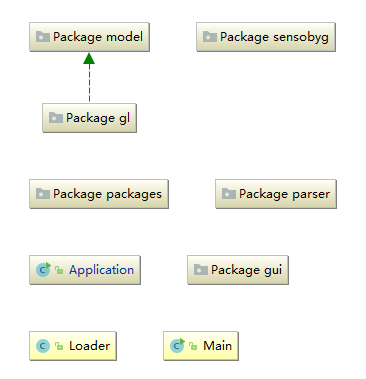
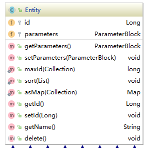
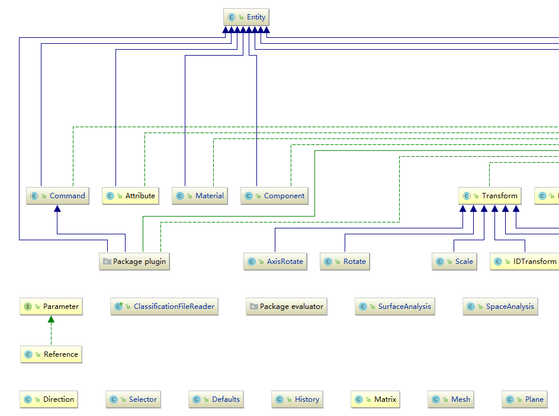
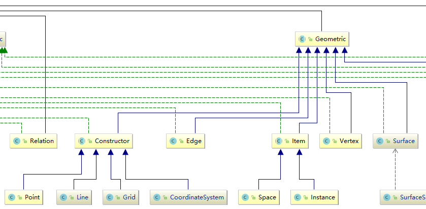
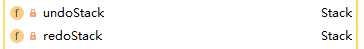
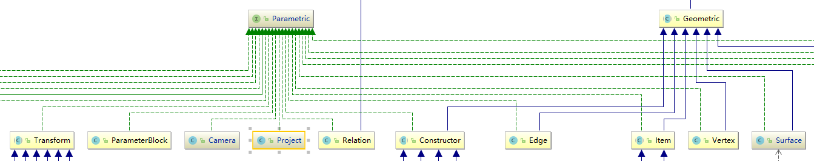
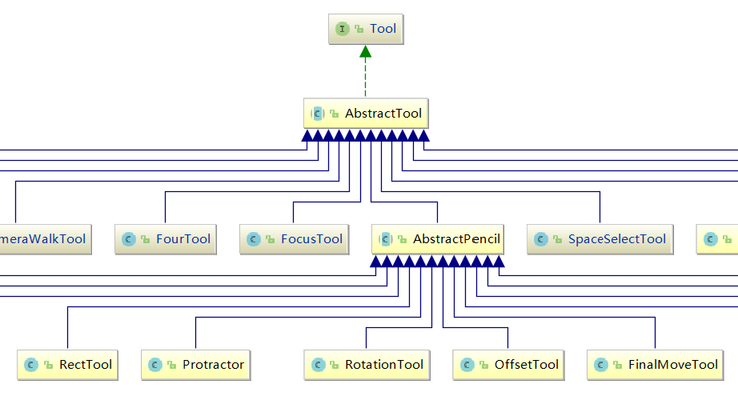

> 为了更好地理解交互式3D建模软件的构成，我先梳理B-Processor中重要的类和方法。
> 所有的UML图我都放在了UML文件夹中

# B-Processor的框架结构

## bprocessor-主框架

b-processor中包含程序的主方法，另有重要的子空间：

* model：3D模型核心
* gl：openGL接口及模型工具
* gui：用户图形界面

## model-模型

所有模型都继承自实体类Entity，它包含了空间物体最一般的方法，相当于一个命名标签。

几何体的构建和传统3D系统类似。

## undo/redo-撤销/重做机制

在Project类中，有两个栈，用于保存撤销重做的属性参数。在每一次可撤回操作中，所有的属性都被保存。下面这段代码大致解释了撤销原理：

    //保存当前状态
    public void checkpoint() {
        //将目前所有接口自Parametic的实体参数化
        final Bmodel state = Persistence.externalize();
        if (state != null) {
            this.redoStack.clear();
            if (this.currentState != null) {
                this.undoStack.push(this.currentState);
                if (this.undoStack.size() > 5) {
                    this.undoStack.remove(0);
                }
            }
            this.currentState = state;
        }
    }
    //撤销至上一状态
    public void undo() {
        if (this.canUndo()) {
            if (this.currentState != null) {
                this.redoStack.push(this.currentState);
            }
            this.setState(this.currentState = this.undoStack.pop());
            Selection.primary().clear();
        }
    }
    //重做至下一状态
    public void redo() {
        if (this.canRedo()) {
            if (this.currentState != null) {
                this.undoStack.push(this.currentState);
            }
            this.setState(this.currentState = this.redoStack.pop());
            Selection.primary().clear();
        }
    }

## gl.tool-交互工具

