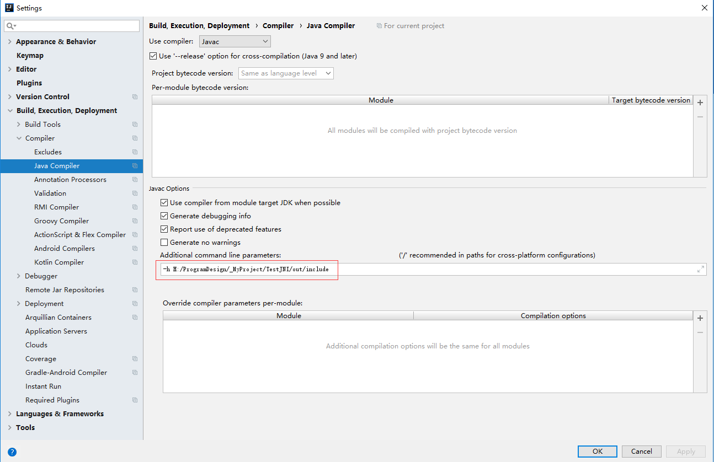
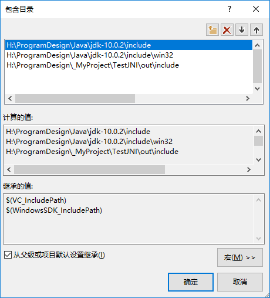
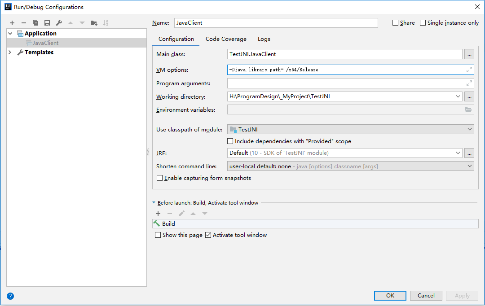

# Java Native Interface (JNI)

> 为了实现Java与C/C++的相互调用，Java使用了JNI技术来实现。下面是官方文档，可惜实用性不强。

> https://docs.oracle.com/javase/10/docs/specs/jni/index.html

> 这篇笔记是基于**IntelliJ Idea**和**VS2017**的。

**目录**

* [Java调用C++](#javausecpp)
  * [在Java中建立接口](#interfaceinjava)
  * [在C++中实现](#implincpp)
  * [在Java中调用](#useinjava)
* [C++调用Java](#cppusejava)
  * Test

<a name="javausecpp"></a>
## Java调用C++

在Java中，是可以加载C++生成的DLL的，但必须事先在Java中设置接口，并从C++实现该接口。

<a name="interfaceinjava"></a>
### 在Java中建立接口


假设Java中需要C++中的一个加法函数：

```cpp

int fun(int a,int b)
{
    return a+b;
}

```

为了调用这个函数，需要现在Java中设置一个接口：

```java

package TestJNI;

public class TestJNI {

    static {
        //System.loadLibrary("TestJNI")会从系统路径中搜索TestJNI.dll
        //TestJNI.dll中应该有fun方法的实现
        System.loadLibrary("TestJNI");
    }
    //该方法的实现位于c++编译的dll中
    public static native int fun(int a,int b);
}

```


现在，编译这个Java类，在高版本的javac.exe中，使用-h <导出目录>，可以导出c++需要的头文件。（在低版本的JDK中，有javah.exe工具来帮助生成头文件。）

在IntelliJ Idea中，在File->Settings->Build, Excution, Deployment->Compiler->Java Compiler中可以设置参数。


编译完成后，会生成含有native方法的头文件。不需要编辑这个头文件，我们只需要在cpp文件中，实现头文件中出现的方法。

```cpp

  /* DO NOT EDIT THIS FILE - it is machine generated */
  #include <jni.h>
  /* Header for class TestJNI_TestJNI */

  #ifndef _Included_TestJNI_TestJNI
  #define _Included_TestJNI_TestJNI
  #ifdef __cplusplus
  extern "C" {
  #endif
  /*
   * Class:     TestJNI_TestJNI
   * Method:    fun
   * Signature: (II)I
   */
  JNIEXPORT jint JNICALL Java_TestJNI_TestJNI_fun
    (JNIEnv *, jclass, jint, jint);

  #ifdef __cplusplus
  }
  #endif

```


<a name="implincpp"></a>
### 在C++中实现
首先创建一个**Win32 Dll**项目，生成的Dll就是Java要使用的。

在C++中要使用JNI，须引用其头文件，头文件包含在JDK的include文件夹中。要包含的目录有：

* \Java\jdk-10.0.2\include
* \Java\jdk-10.0.2\include\win32
* 以及-h参数指定的接口头文件生成位置



现在，创建一个实现TestJNI_TestJNI_Impl.cpp，并写入以下内容：

```cpp
#include <TestJNI_TestJNI.h>

/*
 * Class:     TestJNI_TestJNI
 * Method:    fun
 * Signature: (II)I
 */
JNIEXPORT jint JNICALL Java_TestJNI_TestJNI_fun
(JNIEnv *, jclass, jint a, jint b)
{
	return a + b;
}
```

生成这个项目，会得到一个dll，这个dll就是Java所需要的。

<a name="useinjava"></a>
### 在Java中调用

在任意的Java代码中，调用TestJNI类中的接口。

```java
package TestJNI;

public class JavaClient {
    public static void main(String args[])
    {
        int c = TestJNI.fun(1,2);
        System.out.print(c);
    }
}
```

将dll放在java的工作目录下，或在编译器中通过**-Djava.library.path**参数指定dll所在目录，例如在我的项目中这样设置：

> -Djava.library.path=./x64/Release/



如果dll没有找到，会出现以下错误：

> Exception in thread "main" java.lang.UnsatisfiedLinkError: no TestJNI in java.library.path<br>
> at java.base/java.lang.ClassLoader.loadLibrary(ClassLoader.java:2654)<br>
> at java.base/java.lang.Runtime.loadLibrary0(Runtime.java:876)<br>
> at java.base/java.lang.System.loadLibrary(System.java:1875)<br>
> at TestJNI.TestJNI.<clinit>(TestJNI.java:6)<br>
> at TestJNI.JavaClient.main(JavaClient.java:6)<br>


<a name="cppusejava"></a>
## C++调用Java

###
