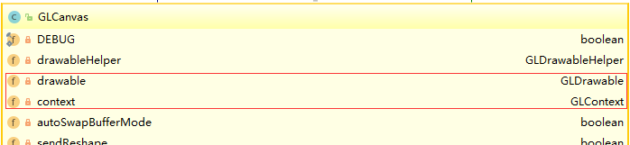
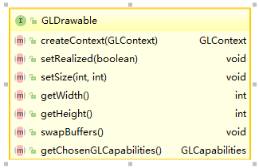
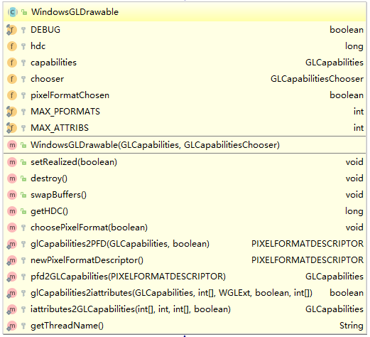
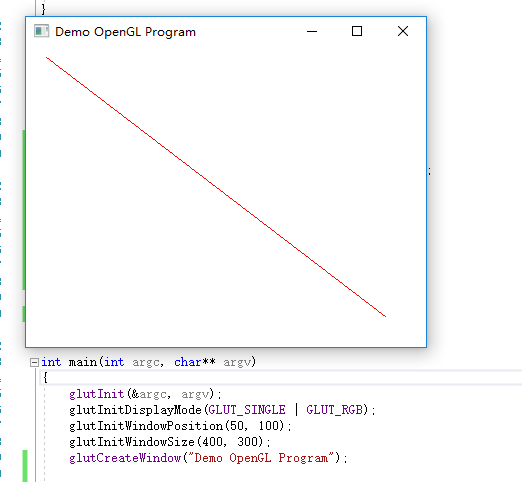

# Java OpenGL (JOGL)

> 在c++环境下，项目已有一些基础，项目的主窗体基于MFC框架；

> 在java环境下，有一些opengl代码和事件处理代码，但这些代码是针对awt框架的；

> 为了在c++中调用这些已有opengl代码和事件处理函数，我需要一个能够在java中操作MFC的opengl句柄。

**由于项目需要，这是基于过时版本的JOGL（1.1.1a）。**

**源码**

> http://jogamp.org/git/?p=jogl.git

## JOGL的结构理解

GLCanvas类可作为Canvas加入到awt的控件中，为了理解其工作机理，下面分析这个类。

GLCanvas类，实现了GLDrawable的接口，它包含两个重要的成员，
**GLDrawable drawable**
和
**GLContext context**。

GLDrawable可以创建GLContext，GLDrawable与窗体和设备句柄关联，GLContext可以获取对应的GL句柄。

* GLCanvas


* GLDrawable


* GLContext


下面是Windows中，GLDrawable的实现：



下面是Windows中，一个用于创建虚拟绘图空间的类**WindowsDummyGLDrawable**：

```java
public class WindowsDummyGLDrawable extends WindowsGLDrawable {
  //窗体句柄
  private long hwnd;

  public WindowsDummyGLDrawable() {
    super(new GLCapabilities(), null);
    // All entries to CreateDummyWindow must synchronize on one object
    // to avoid accidentally registering the dummy window class twice
    synchronized (WindowsDummyGLDrawable.class) {
      hwnd = WGL.CreateDummyWindow(0, 0, 1, 1);
    }
    hdc = WGL.GetDC(hwnd);
    // Choose a (hopefully hardware-accelerated) OpenGL pixel format for this device context
    GLCapabilities caps = new GLCapabilities();
    caps.setDepthBits(16);
    PIXELFORMATDESCRIPTOR pfd = glCapabilities2PFD(caps, true);
    int pixelFormat = WGL.ChoosePixelFormat(hdc, pfd);
    if ((pixelFormat == 0) ||
        (!WGL.SetPixelFormat(hdc, pixelFormat, pfd))) {
      destroy();
    }
  }

  public void setSize(int width, int height) {
  }

  public int getWidth() {
    return 1;
  }

  public int getHeight() {
    return 1;
  }

  public GLContext createContext(GLContext shareWith) {
    if (hdc == 0) {
      // Construction failed
      return null;
    }
    return new WindowsGLContext(this, shareWith, true);
  }

  public void destroy() {
    if (hdc != 0) {
      WGL.ReleaseDC(hwnd, hdc);
      hdc = 0;
    }
    if (hwnd != 0) {
      WGL.ShowWindow(hwnd, WGL.SW_HIDE);
      WGL.DestroyWindow(hwnd);
      hwnd = 0;
    }
  }
}
```

## Java中的外部GL

下面介绍的两个类，能够获取当前HDC与当前HGLRC。由于在同一线程中，wgl方法共享唯一的当前句柄，所以在java中调用wglGetCurrentContext()能获取相同的句柄，于是就能利用Java中的GL方法，在C++的窗体中绘图。

### WindowsExternalGLDrawable

```java
public class WindowsExternalGLContext extends WindowsGLContext {
  private boolean firstMakeCurrent = true;
  private boolean created = true;
  private GLContext lastContext;

  public WindowsExternalGLContext() {
    super(null, null, true);
    hglrc = WGL.wglGetCurrentContext();
    if (hglrc == 0) {
      throw new GLException("Error: attempted to make an external GLContext without a drawable/context current");
    }
    if (DEBUG) {
      System.err.println(getThreadName() + ": !!! Created external OpenGL context " + toHexString(hglrc) + " for " + this);
    }
    GLContextShareSet.contextCreated(this);
    resetGLFunctionAvailability();
  }

  public int makeCurrent() throws GLException {
    // Save last context if necessary to allow external GLContexts to
    // talk to other GLContexts created by this library
    GLContext cur = getCurrent();
    if (cur != null && cur != this) {
      lastContext = cur;
      setCurrent(null);
    }
    return super.makeCurrent();
  }

  public void release() throws GLException {
    super.release();
    setCurrent(lastContext);
    lastContext = null;
  }

  protected int makeCurrentImpl() throws GLException {
    if (firstMakeCurrent) {
      firstMakeCurrent = false;
      return CONTEXT_CURRENT_NEW;
    }
    return CONTEXT_CURRENT;
  }

  protected void releaseImpl() throws GLException {
  }

  protected void destroyImpl() throws GLException {
    created = false;
    GLContextShareSet.contextDestroyed(this);
  }

  public boolean isCreated() {
    return created;
  }
}
```
### WindowsExternalGLContext
```java
public class WindowsExternalGLContext extends WindowsGLContext {
  private boolean firstMakeCurrent = true;
  private boolean created = true;
  private GLContext lastContext;

  public WindowsExternalGLContext() {
    super(null, null, true);
    hglrc = WGL.wglGetCurrentContext();
    if (hglrc == 0) {
      throw new GLException("Error: attempted to make an external GLContext without a drawable/context current");
    }
    if (DEBUG) {
      System.err.println(getThreadName() + ": !!! Created external OpenGL context " + toHexString(hglrc) + " for " + this);
    }
    GLContextShareSet.contextCreated(this);
    resetGLFunctionAvailability();
  }

  public int makeCurrent() throws GLException {
    // Save last context if necessary to allow external GLContexts to
    // talk to other GLContexts created by this library
    GLContext cur = getCurrent();
    if (cur != null && cur != this) {
      lastContext = cur;
      setCurrent(null);
    }
    return super.makeCurrent();
  }

  public void release() throws GLException {
    super.release();
    setCurrent(lastContext);
    lastContext = null;
  }

  protected int makeCurrentImpl() throws GLException {
    if (firstMakeCurrent) {
      firstMakeCurrent = false;
      return CONTEXT_CURRENT_NEW;
    }
    return CONTEXT_CURRENT;
  }

  protected void releaseImpl() throws GLException {
  }

  protected void destroyImpl() throws GLException {
    created = false;
    GLContextShareSet.contextDestroyed(this);
  }

  public boolean isCreated() {
    return created;
  }
}
```

## 利用外部GL操作C++

### Java中的代码

现在，定义两个方法，**getGLContext**
用于获取Java外部的HDC和HGLRC，**renderLoop**
用于渲染。

```java
public class JoglWithCpp {

    //调用本类时，读取jogl.dll
    static {
        System.loadLibrary("jogl");
    }

    static GLDrawable drawable;

    static GLContext context;

    static GL gl;

    //获取外部句柄
    public static int getGLContext(long hwnd,long hdc)
    {
        GLDrawableFactory factory =GLDrawableFactory.getFactory();
        //get current DC
        drawable = factory.createExternalGLDrawable();
        //get current GLRC
        context = factory.createExternalGLContext();
        //GL
        gl = context.getGL();

        return 1;
    }

    //渲染循环
    public static int renderLoop()
    {
        gl.glClear(gl.GL_COLOR_BUFFER_BIT);
        gl.glColor3f(1.0f, 0.0f, 0.0f);
        gl.glBegin(gl.GL_LINES);
        gl.glVertex2i(180, 15);
        gl.glVertex2i(10, 145);
        gl.glEnd();
        gl.glFlush();

        return 1;
    }
}
```

### C++中的代码
利用JVM虚拟机，调用编译好的Java代码。关于JVM虚拟机的使用方法及说明，请参这篇笔记

> [Java Native Interface (JNI)](Java%20Native%20Interface.md)

这里使用freeglut库来建立窗口，freeglut库是glut的现代版本。下面是windows的发布版链接。

> https://www.transmissionzero.co.uk/software/freeglut-devel/

我们需要引用一些头文件和定义一些全局变量。

```cpp
#include <windows.h>

#include <gl/GL.h>
#include <gl/glut.h>

#include <jni.h>

//java虚拟机
JavaVM *jvm = NULL;       /* denotes a Java VM */
//java虚拟环境
JNIEnv *env = NULL;       /* pointer to native method interface */

//反射得到的类
jclass cls;
//反射得到的方法
jmethodID renderLoop;
```

接着，定义初始化方法，渲染循环，主函数。

```cpp
void init(void)
{
	glClearColor(1.0, 1.0, 1.0, 0.0);

	glMatrixMode(GL_PROJECTION);
	gluOrtho2D(0.0, 200.0, 0.0, 150.0);

	JavaVMInitArgs vm_args; /* JDK/JRE 9 VM initialization arguments */
	JavaVMOption* options = new JavaVMOption[2];

  //java类库
	char ostr1[] = "-Djava.class.path=H:/ProgramDesign/_MyProject/JavaOpenGLWithCpp/out/production/JoglWithCpp;H:/ProgramDesign/_MyProject/JavaOpenGLWithCpp/tools/jogl/jogl.jar;H:/ProgramDesign/_MyProject/JavaOpenGLWithCpp/tools/jogl/gluegen-rt.jar;";
  //java引用的dll位置
	//char ostr2[] = "-Djava.library.path=H:/ProgramDesign/_MyProject/JavaOpenGLWithCpp/tools/jogl/win64";

	options[0].optionString = ostr1;
	//options[1].optionString = ostr2;
	vm_args.version = JNI_VERSION_10;
	vm_args.nOptions = 1;
	vm_args.options = options;
	vm_args.ignoreUnrecognized = true;
	/* load and initialize a Java VM, return a JNI interface
	 * pointer in env */
	JNI_CreateJavaVM(&jvm, (void**)&env, &vm_args);

	cls = env->FindClass("jpp/JoglWithCpp");
	jmethodID getGLContext = env->GetStaticMethodID(cls, "getGLContext", "()I");

	renderLoop = env->GetStaticMethodID(cls, "renderLoop", "()I");

	int res = env->CallStaticIntMethod(cls, getGLContext);
}

void lineSegment(void)
{
	//调用 java中的 opengl绘制代码
	int res = env->CallStaticIntMethod(cls, renderLoop);
}

int main(int argc, char** argv)
{
	glutInit(&argc, argv);
	glutInitDisplayMode(GLUT_SINGLE | GLUT_RGB);
	glutInitWindowPosition(50, 100);
	glutInitWindowSize(400, 300);
	glutCreateWindow("Demo OpenGL Program");

	init();

	glutDisplayFunc(lineSegment);
	glutMainLoop();
}
```
最后上个图吧。


