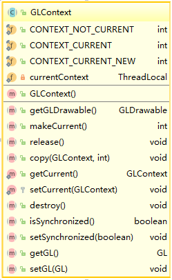

# Java OpenGL (JOGL)

> 在c++环境下，项目已有一些基础，项目的主窗体基于MFC框架；

> 在java环境下，有一些opengl代码和事件处理代码，但这些代码是针对awt框架的；

> 为了在c++中调用这些已有opengl代码和事件处理函数，我需要一个能够在java中操作MFC的opengl句柄。

**由于项目需要，这是基于过时版本的JOGL（1.1.1a）。**

**源码**

> http://jogamp.org/git/?p=jogl.git

## JOGL的结构理解

GLCanvas类可作为Canvas加入到awt的控件中，为了理解其工作机理，下面分析这个类。

GLCanvas类，实现了GLDrawable的接口，它包含两个重要的成员，
**GLDrawable drawable**
和
**GLContext context**。

GLDrawable可以创建GLContext，GLDrawable与设备和窗体句柄关联，GLContext可以获取对应的GL句柄。

* GLCanvas


* GLDrawable


* GLContext



下面是Windows中，GLDrawable的实现：


下面是Windows中，一个用于创建虚拟绘图空间的类**WindowsDummyGLDrawable**：

```java
public class WindowsDummyGLDrawable extends WindowsGLDrawable {
  //窗体句柄
  private long hwnd;

  public WindowsDummyGLDrawable() {
    super(new GLCapabilities(), null);
    // All entries to CreateDummyWindow must synchronize on one object
    // to avoid accidentally registering the dummy window class twice
    synchronized (WindowsDummyGLDrawable.class) {
      hwnd = WGL.CreateDummyWindow(0, 0, 1, 1);
    }
    hdc = WGL.GetDC(hwnd);
    // Choose a (hopefully hardware-accelerated) OpenGL pixel format for this device context
    GLCapabilities caps = new GLCapabilities();
    caps.setDepthBits(16);
    PIXELFORMATDESCRIPTOR pfd = glCapabilities2PFD(caps, true);
    int pixelFormat = WGL.ChoosePixelFormat(hdc, pfd);
    if ((pixelFormat == 0) ||
        (!WGL.SetPixelFormat(hdc, pixelFormat, pfd))) {
      destroy();
    }
  }

  public void setSize(int width, int height) {
  }

  public int getWidth() {
    return 1;
  }

  public int getHeight() {
    return 1;
  }

  public GLContext createContext(GLContext shareWith) {
    if (hdc == 0) {
      // Construction failed
      return null;
    }
    return new WindowsGLContext(this, shareWith, true);
  }

  public void destroy() {
    if (hdc != 0) {
      WGL.ReleaseDC(hwnd, hdc);
      hdc = 0;
    }
    if (hwnd != 0) {
      WGL.ShowWindow(hwnd, WGL.SW_HIDE);
      WGL.DestroyWindow(hwnd);
      hwnd = 0;
    }
  }
}
```

## 在Java中使用C++创建的OpenGL环境

为了在Java中使用这个环境，我们需要把C++中的hdc和hwnd传入Java，并实现一种基于外来句柄的画图类。首先这个类应当继承于**WindowsGLDrawable**，结构与**WindowsDummyGLDrawable**非常类似，唯一区别，是它不是自动创建hdc和hwnd句柄，而是接受句柄。
