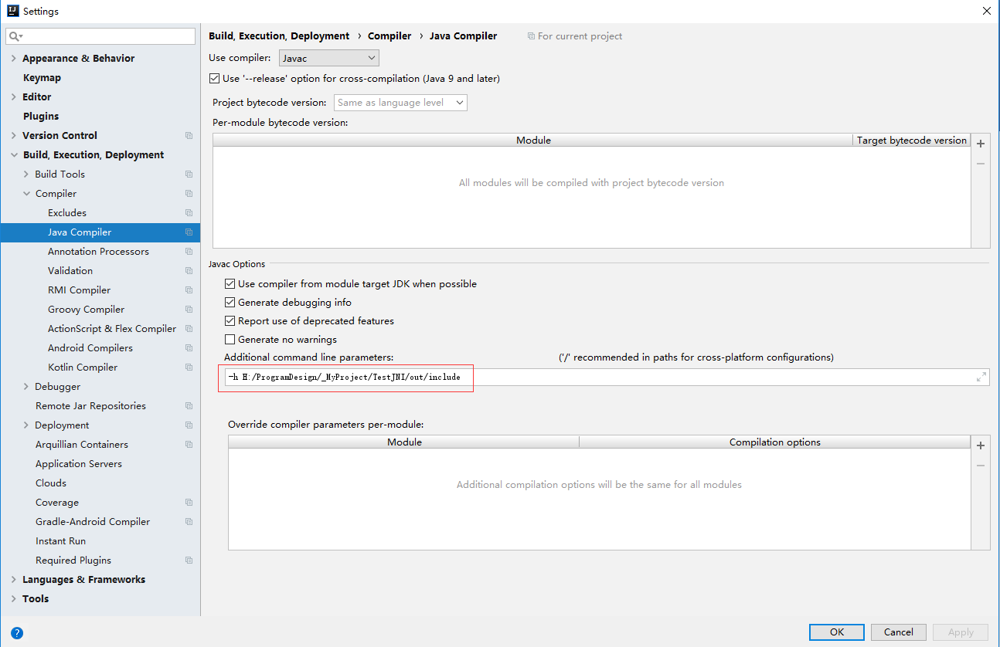

# Java Native Interface(JNI)

> 为了实现Java与C/C++的相互调用，Java使用了JNI技术来实现。下面是官方文档，可惜实用性不强。

> https://docs.oracle.com/javase/10/docs/specs/jni/index.html

> 这篇笔记是基于**IntelliJ Idea**和**VS2017**的。

**目录**

* [Java调用C++](#javausecpp)
  * 在Java中建立接口
  * 在C++中实现
* [C++调用Java](#cppusejava)
  * Test

<a name="javausecpp"></a>
## Java调用C++

在Java中，是可以加载C++生成的DLL的，但必须事先在Java中设置接口，并从C++实现该接口。

假设Java中需要C++中的一个加法函数：

```cpp
int fun(int a,int b)
{
    return a+b;
}
```

为了调用这个函数，需要现在Java中设置一个接口：

```java
package TestJNI;

public class TestJNI {

    static {
        //System.loadLibrary("TestJNI")会从系统路径中搜索TestJNI.dll
        //TestJNI.dll中应该有fun方法的实现
        System.loadLibrary("TestJNI");
    }
    //该方法的实现位于c++编译的dll中
    public static native int fun(int a,int b);
}
```

现在，编译这个Java类，在高版本的javac.exe中，使用-h <导出目录>，可以导出c++需要的头文件。（在低版本的JDK中，有javah.exe工具来帮助生成头文件。）

在IntelliJ Idea中，在File->Settings->Build, Excution, Deployment->Compiler->Java Compiler中可以设置参数。



<a name="cppusejava"></a>
## C++调用Java


