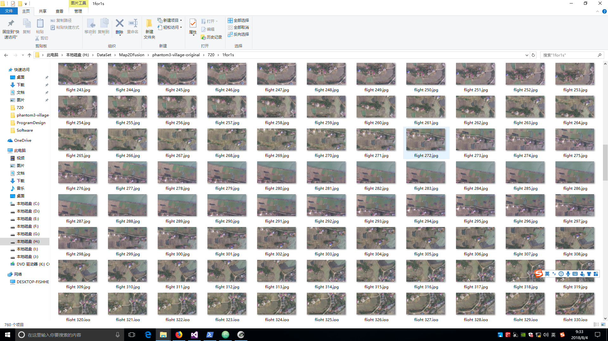
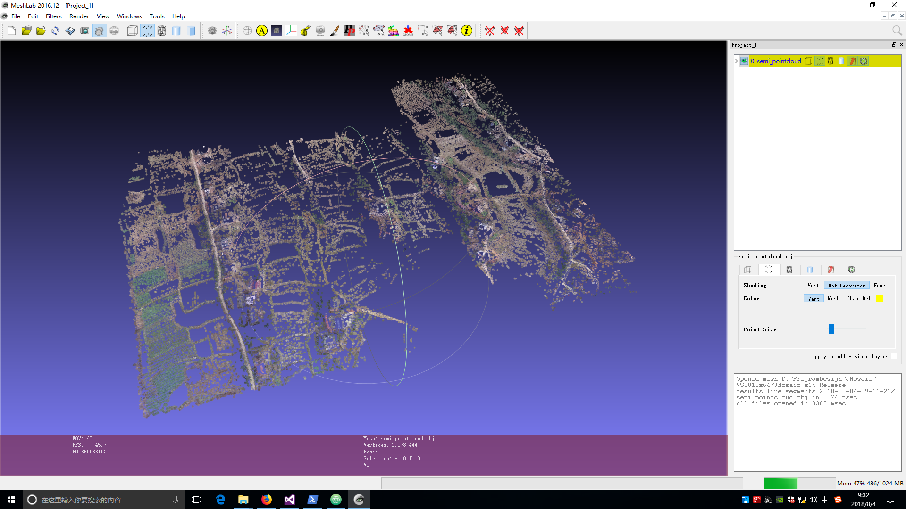

# 存在的问题

* Frame类消耗内存太多，不是所有Frame都需要保存各种图
* 半密集点云数量不足
* InterKeyFramesDepthChecking平均1.5s，有待提速
* 无限制使用内存存储rbg和gray影像，会让程序非常庞大

# 拟改进方案
* 只有当Frame作为Key-Frame时，才保存影像和对应的各种图
* 尝试取更小的梯度阈值
* 建立一个内存上的影像缓存，只保存最近被请求的N张影像，若超过N张影像被请求，自动清除第0张影像，当有新的影像被请求，从硬盘读取

#测试结果

